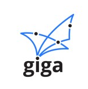

  

# Giganodes Project Summary

In December 2021 Giga started working with Launchnodes and the Ethereum Foundation to explore if Ethereum Staking could be used as a long term financing tool to pay for schools internet connectivity. This work is part of Giga’s objective which is to connect every school in the world with internet connectivity.

Giga, in partnership with UNICEF Rwanda, the Rwandan government, the Ethereum Foundation and Launchnodes, have started running Ethereum validator nodes to stake Ether, and to use the rewards from staking Ether to pay for Internet connectivity in Rwandan schools.

## What we wanted to do.

The goal of this project has been to launch a product over 12 months that delivers the following 3 outcomes:

1. An open-source recipe to be used to run Beacon and Validator nodes, whose staking returns pay for the ongoing Internet connectivity costs for the pilot schools selected in Rwanda
2. To provide a mechanism for investors to commit capital to run nodes that they get back at the end of 3 years, that provisions for the long-term cost of Internet connectivity for schools in developing countries.
3. To promote decentralised staking, by initially staking in the cloud, but building a plan with the Rwandan government to make it legal to run nodes locally in Rwanda, using the staking rewards for societal good.

## Project Team

This initiative is driven by Giga, with support from The Ethereum Foundation, the Rwandan government and UNICEF.  Launchnodes are providing the technical expertise and project delivery

This project is funded by Giga, with funding approved.

The Ethereum Foundation have donated Ether for the proof of concept.

This project ran over 12 months.

## Why we wanted to do it

Rwandan schools, whose Internet connectivity is funded through this initiative will be direct beneficiaries of this project.

Rwanda will be a beneficiary more broadly, demonstrating leadership through its early adoption of innovative technologies, and establishing new capabilities and opportunities within the country.

Once the model for funding school Internet connectivity has been proved in Rwanda, the project has the potential to be scaled up – providing more funding for connectivity, with the potential to expand to other countries in Africa and globally.

## How we delivered it

## The Financial Model

In order to support this model of paying for the long term connectivity for schools using nodes, this project has built a simple financial model which can be found here that allows Giga and donors and the government to understand

1. How many nodes can be run through a donors allocation of capital over 3 years
2. What happens to the returns as the price of Ethereum Varies against the USD
3. With the number of nodes running what ends up being a conservative calculation on how many schools internet connection can be paid for using a specific amount of nodes.

The financial model is especially important due to the volatility of the price of ETH in relation to the USD. The Financial Model can be found in repo and used by anybody want to start building a model for this or related use cases.

## The Node

The Validator node that the Ethereum Foundation funded for the purpose of generating staking returns that would pay for schools internet connectivity is validator number 393337 and the dashboard that shows its performance and lifetime earning can be view through this link

https://beaconcha.in/validator/89b7ea05aff2dc711cc35fdd19b2b73cf3760b80da7d0db8488b9ebc4fca1afa7424cfbb3dd45fb132eefbb3b7ee9c29#charts

The validator has been:

|||
| --- | --- |
| **Eligible since** | [17 May 2022, 07:46](https://beaconcha.in/epoch/119651) |
| **Active since** | [28 May 2022, 12:34](https://beaconcha.in/epoch/122171)

If you would like further information regarding this node, please contact Giga

## The ISP

The pilot project involved using broadband circuits provided by a local internet service provider BSC. The way returns were taken off the node and converted and the ISP paid is explained with a process flow in the project documentation. The choice of ISP and the data collected on the broadband circuits is out of scope for this documentation but can be provided by Giga.

  

