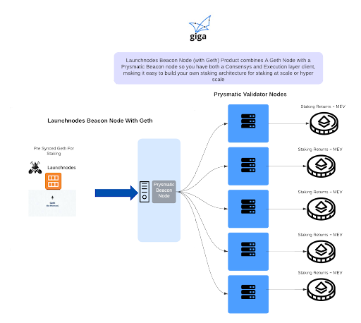
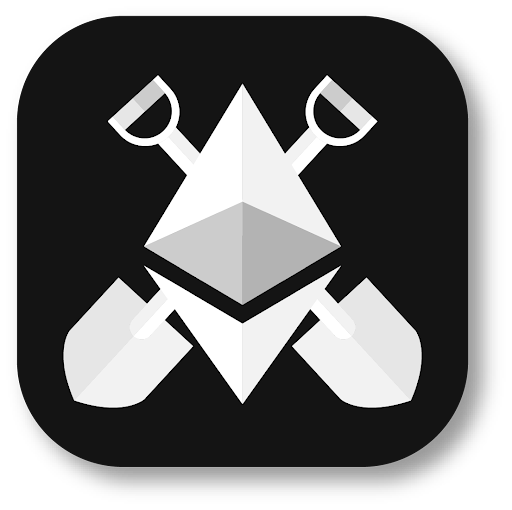

  

Beacon Node (with Geth) Product Instructions For Public Cloud (AWS)
==

## What Is This Document For

People who want to set up an Ethereum Node on a public cloud (AWS) for the purpose of using staking returns to pay for schools internet connectivity as part of Giga.

Use this document and set up your beacon with Geth prior to trying to set up your validator nodes. If you need any help email: <ins>support@giganodes.com</ins> or <ins>support@launchnodes.com</ins>

## Cloud Vs Local Hosting

At the time of writing this document many governments do not have clear policies in place that allow staking to take place in the country a social impact staker is looking to support. To ensure that you are compliant with local laws, an interim method is to use nodes that are hosted on public cloud. In the pilot project nodes were Launched in AWS. This document allows anyone to follow the pattern established in the pilot.

The goal with the pilot approach was to host the node in the cloud until it became legal and compliant with local laws in Rwanda to host a node locally in the country. This was a decision made by the Impact Staker and donor who in this was Ethereum Foundation.

## Migrating From Cloud to Locally Hosted Nodes

Giga and Launchnodes can provide full support to migrate cloud hosted nodes onto local infrastructure in the country where an impact staker wants to host their nodes.

## Beacon Nodes allow Validator nodes to connect and stake

To stake Ethereum, validator nodes are required to connect to Beacon nodes. The Validator and the beacon node are referred to as consensus layer clients. For the pilot in Rwanda, Prysmatic clients were chosen. The Beacon node Consensus layer client needs to connect to an execution layer client in order to synchronise, for the pilot and more broadly the consensus layer client that is used is Geth. The diagram provides a high level architecture of how the nodes work.

## Custody

Giga does not take custody of the Ethereum being staked. The donor can manage their own custody using the pattern established in this pilot and highlighted in other documentation. This can be done independently, with Launchnodes support or using other custodial solutions.

The impact staker gets their money back after a given period of time that they have committed to support GIga, to ensure this functionality works, impact stakers keep their Ethereum and the nodes they stake on and simply give the returns from their validator nodes.

**Prysmatic Beacon Node (Consensys Layer Client) With Geth (Execution Layer Client)**

Launchnodes Beacon node product combines the Prysmatic Beacon Node with a Geth node. Providing you with both an execution layer client and a consensus layer client that allows you to stake Ethereum easily at scale and hyper scale. Using your own AWS infrastructure/account and also allowing you to choose validator node ratios, instance types and to choose your own level of redundancy.

The instructions will guide you through the following 6 steps.

* Registering
* Product Purchase
* Key Pair creation
* Cluster Creation
* Service Creation
* Checking the Node Status

**[<ins>Register</ins>](https://www.launchnodes.com/register-for-enhanced-support/) to get free enhanced support that includes**

* Early notification of planned software client updates
* Email/online conferencing support for setting up Beacon and Validator nodes
* Email and online conferencing support for existing Launchnodes products

**This detailed instruction guide will help you to run your combined Beacon and Geth node on AWS.**

**Note: If you have any queries / need support contact us on <ins>support@launchnodes.com</ins>**

**Product Purchase:**

The first step is to purchase a beacon node from AWS marketplace please avoid these steps if you already purchased the product.

1. Go to the [<ins>Ethereum 2.0 Prysmatic Beacon Node</ins>](https://aws.amazon.com/marketplace/pp/prodview-l7ya6gn4r2xyq?sr=0-3&ref_=beagle&applicationId=AWSMPContessa).
2. Click on Continue to subscribe.
3. Click on accept terms.
4. Click on configure contract to configure product licence for a year.
5. Now, select “Unit type” as ECS tasks from Contract options and select the number of licences you require.
6. Click on the” create contract” button and confirm your contract details. Now, You have a valid subscription.

**Note:** If you already have one beacon node cluster running and want to create another cluster then use the following [<ins>documentation</ins>](https://docs.google.com/document/d/1XmUxKUXAAIgT4aevEzw1UYv_v_hFi7dS2KHOr4cleHc/edit?usp=sharing).

**Key-Pair Generation:**

To see the video reference of aws key creation follow our video guide [<ins>here</ins>](https://drive.google.com/file/d/1ClKlq-cSoOUiIxgI02QzHpZbxZTPup-_/view?usp=sharing).

1. Go to aws console <ins>https://aws.amazon.com/console/</ins> and search ec2 in search-bar and click on "EC2"
2. Find "Key Pairs" under "Network and Security" from the side menu and click on that.
3. Click on "Create key pair".
4. Enter the name of your choice in the Name field.(e.g Validator node)
5. Select File format option to "pem".
6. Click on "Create key pair" and download the pem file.

**Cluster Creation:**

To see the video reference of below instructions please visit this [<ins>video</ins>](https://drive.google.com/file/d/1TqY7wq7PhUxPaz1MwmpNKbpm-tUbUau3/view?usp=sharing).

1. Sign in to the AWS [<ins>Console</ins>](https://console.aws.amazon.com), In All Services, choose [<ins>CloudFormation</ins>](https://console.aws.amazon.com/cloudformation/).
2. In the navigation pane, choose Stack and then choose Create Stack.
3. Under Prerequisite-Prepare Template, choose Template is ready.
4. Under Specify Template, choose the Template Source as Amazon S3 URL and enter [<ins>this URL</ins>](https://beacon-node-cf.s3.us-west-1.amazonaws.com/BeaconNodeCF_ClusterCreation.json) and click on next.
5. In the Specify Stack Details, enter the Stack name as “beacon-cluster-creation-stack” or your desired stack name.
6. In the Parameters,
    <ol type="a">
        <li>In the KeyName, select the existing key pair from existing keys.</li>
    </ol>
7. Click on Next.
8. In the Configure stack options, click on Next.
9. In the Review Stack, review your stack details and in Capabilities, check the box which says “I acknowledge that AWS CloudFormation might create IAM resources with custom names.”
10. Click on Create Stack.

**Service Creation configuration and deployment using cloud formation templates:**

To see the video reference of below instructions please visit this [<ins>video</ins>](https://drive.google.com/file/d/1UfN5nIhAILiQPcev_RdshbiNWUGsyZG2/view?usp=sharing).

1. Sign in to the AWS [<ins>Cloudformation</ins>](https://eu-west-2.console.aws.amazon.com/cloudformation/)
2. In the navigation pane, choose Stack and then choose Create Stack.
3. In the Prerequisite-Prepare Template, choose Template is ready.
4. In the Specify Template, choose the Template Source as Amazon S3 URL and enter [<ins>this URL</ins>](https://beacon-node-cf.s3.us-west-1.amazonaws.com/BeaconNodeCF_ServiceCreation.json) and click on next.
5. In the Specify Stack Details, enter the Stack name “beacon-service-creation-stack” or as your desired stack name.
6. In the Parameters:
    <ol type="a">
        <li>In the ClusterName, enter the Cluster Name as the same cluster name that you have set during Cluster Creation or the cluster name to which you want to connect. Eg: Beacon-Cluster</li>
    </ol>
7. Choose Next.
8. In the Configure stack options, choose next.
9. In the Review Stack, review your stack details and in Capabilities, check the box which says “I acknowledge that AWS CloudFormation might create IAM resources with custom names.”
10. Choose Create-stack.

Congratulations, your geth node and beacon node is now set up in your AWS account. You can check the logs of both the nodes by following the instructions below.

---

**Geth and Beacon Node status check**

**Geth-Service Logs Check:**

To see the video reference of below instructions please visit this [<ins>video</ins>](https://drive.google.com/file/d/1pbXWraM9bzqP6Oeb9BPmbPzfznXGdlrI/view?usp=sharing).

1. Go to ECS page (<ins>https://aws.amazon.com/ecs/</ins>) then click on get started with ECS.
2. Select  "Cluster" from the side menu.
3. Now, You will see the running clusters(Beacon-Cluster), click on the cluster name.
4. In the Service, click on the “Geth-Service”.
5. In the Tasks, click on the running task.
6. Now, Scroll down to the Containers, in the Name, click on to the drop down arrow on the left of “geth_container”.
7. Now, Scroll down to the end of the page and click on “View logs in CloudWatch”.
8. And then you can see your Geth-Service logs.

**Beacon-Service Logs Check:**

To see the video reference of below instructions please visit this [<ins>video</ins>](https://drive.google.com/file/d/1WKnE0O6RDc6WPp7CCclpl432u8sGJKIT/view?usp=sharing).

1. Go to ECS page (<ins>https://aws.amazon.com/ecs/</ins>) then click on get started with ECS.
2. Select  "Cluster" from the side menu.
3. Now, You will see the running clusters(Beacon-Cluster), click on the cluster name.
4. In the Service, click on the “Beacon-Service”.
5. In the Tasks, click on the running task.
6. Now, Scroll down to the Containers, in the Name, click on to the drop down arrow on the left of “beacon_container”.
7. Now, Scroll down to the end of the page and click on “View logs in CloudWatch”.
8. And then you can see your Beacon-Service logs.

  

