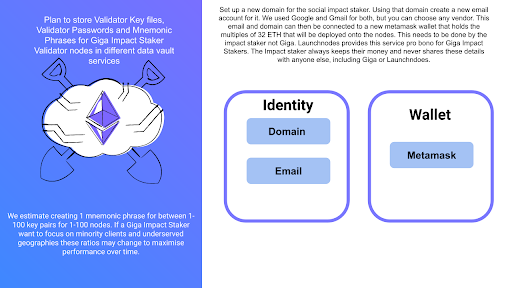
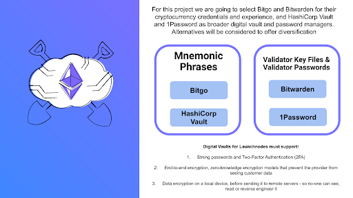
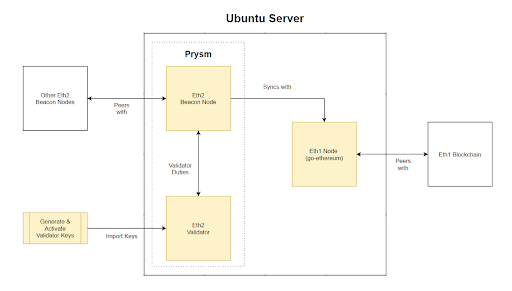

  

Giganodes ETH Staking For Schools
==

In December 2021 **Giga** started working wih the **Ethereum Foundation** and Launchnodes to explore if Ethereum Staking could be used as a long term financing tool to pay for schools internet connectivity. This work is part of Giga’s objective which is to connect every school in the world with internet connectivity.

**Giga**, in partnership with UNICEF and governments in developing countries, the Ethereum Foundation and Launchnodes, have started running Ethereum validator nodes to stake Ether, and to use the rewards from staking Ether to pay for Internet connectivity in pilot Rwandan schools.

You can check the status of the Validator node and how much it has earned to pay for schools internet connectivity [here](https://beaconcha.in/validator/89b7ea05aff2dc711cc35fdd19b2b73cf3760b80da7d0db8488b9ebc4fca1afa7424cfbb3dd45fb132eefbb3b7ee9c29#deposits).

<ins>The validator node number</ins> is 393337.

# What we wanted to do

The **goal** of this project has been to launch a product over 12 months that delivers the following 3 outcomes:

1. A usuable open-source recipe to be used to run Beacon and Validator nodes, whose staking returns pay for the ongoing Internet connectivity costs for the pilot schools selected in Rwanda
2. To provide a mechanism for investors to commit capital to run nodes that they get back at the end of 3 years, that provisions for the long-term cost of Internet connectivity for schools in developing countries.

To **promote** decentralised staking, by initially staking in the cloud to ensure regulatory compliance but providing a recipe to run nodes on bare metal, using the staking rewards for societal good.

These nodes can be owned by the Impact Staker who is defined as the person donating ETH for a period of time to support funding school connectivity, or directly by a government.

# What are these Documents For

This document is for people who want to stake Ethereum and use the returns to pay for school internet connectivity in developing countries in partnership with Giga

This document explains how you run a Beacon Node and Validator node on your own servers in your own hosting facility, effectively. Maximising the opportunity to earn ETH and minimising the risk of slashing events.

Using this method of staking is called Solo Staking. This is the preferred method of staking by the Ethereum Foundation and you can learn more about [Solo Staking here](https://ethereum.org/en/staking/solo/).

# Regulations

The way **Ethereum staking** is regulated is different for individual countries. In some countries it is banned or not considered legal in others it is not regulated and deemed to be done at the risk of the person staking.

Prior to considering using ETH staking to finance Giga connectivity in schools it's imperative to understand and comply with domestic laws and regulations.

If you would like help and advice from Giga on this contact support@giganodes.com.

In this pilot project we worked with the Rwandan Government and the Central Bank of Rwanda to comply with their laws on Crypto-currency and staking.

These laws and regulations are evolving and checking regularly to ensure you are compliant in the jurisdiction in which the schools whose connectivity is being paid for by staking ETH is important.

# Local Hosting the Ethereum Foundation and Giga’s preferred method

There are **two ways** to stake Ethereum.

1. Using public cloud providers to provide infrastructure and connectivity
2. Using your own infrastructure and connectivity

**Option 2** contributes to **decentralising Ethereum** and **improving the resilience** of the Ethereum Network and is the preferred method of staking as outlined by the Ethereum Foundation.

However, when using staking to pay for internet connectivity in schools, it is extremely important that you are compliant with laws and regulations in the country whose schools you are looking to support.

**Giga** and **the Ethereum foundation** would like Ethereum staking and the nodes that do the work of staking to run in the countries where school connectivity is being paid for. Giga can help engage with Governments and impact stakers to work with governments to ensure doing this is compliant and in line with Government and Central bank policies.

This project documentation provides a recipe and detailed instructions of how to set up nodes on your own servers that run in your own data centres.

# Key Considerations

In order to host and run Ethereum staking nodes you need to consider the following things. Giga can help guide and advise if you have questions or need information or support interfacing with Governments.

# Government regulations

Make sure staking is legal in the country you are doing and that you have government or regulatory approval to stake Ethereum and use the funds from staking to pay for school internet connectivity in that country.

# Reliable Internet connectivity

Earning the **maximum returns** from staking requires good internet connectivity. When looking at data centres or hosting facilities, reliability and **quality** of your internet connection should be a top priority.

Your **validator node** rewards are proportional to the time your validator is online and properly attesting. Downtime incurs penalties proportional to how many other validators are offline at the same time, but does not result in slashing. Bandwidth also matters, as rewards are decreased for attestations that are not received in time. Requirements will vary, but a minimum of 10 Mb/s up and down is recommended by the Ethereum Foundation.  Testing this before you run your nodes is important.

# High Quality hosting infrastructure

When using your own infrastructure it is useful to determine and categorise the overall quality of the hosting environment in which your nodes will be running.

To do this, we recommend using the Uptime Institute categorisation of data centre infrastructure into 4 tiers as a benchmark.

The four data center tiers certified by the Uptime Institute are:

**Tier 1:** A data center with a single path for power and cooling, and no backup components. This tier has an expected uptime of 99.671% per year.

**Tier 2:** A data center with a single path for power and cooling, and some redundant and backup components. This tier offers an expected uptime of 99.741% per year.

**Tier 3:** A data center with multiple paths for power and cooling, and redundant systems that allow the staff to work on the setup without taking it offline. This tier has an expected uptime of 99.982% per year.

**Tier 4:** A completely fault-tolerant data center with redundancy for every component. This tier comes with an expected uptime of 99.995% per year.

**Giga** recommends running your nodes in a hosting environment that provides uptime to at least tier 1 levels as defined by the Uptime Institute, in order to maximise the earning capability from your nodes. The more your nodes earn the more money available to pay for schools internet connectivity.

If **Tier 1** data centre infrastructure or equivalent is not available in the country you are looking to run nodes in. E-mail support@giganodes.com to get help and advice from our team on what might work as an alternative.

# Custody

Giganodes approach is based on not requiring the impact staker to give their Ethereum to Giga, simply stake it and commit the returns to pay for schools internet connectivity.

This means the impact staker has custody of their own Ethereum.

The approach that was used during the pilot project was effective and allowed for this model and is a pattern that we recommend using more broadly.

## Step 1

## Step 2

## Establish a Pattern

This is a new approach and new technology. What we have done through this pilot project is establish a pattern for

* Managing regulatory obligations
* Choosing a location from where to run the nodes.
* Establishing how the impact staker will manage custody.
* Determining a technology stack to use when staking.

These have been used for the pilot project, feel free to copy them and adjust them to your requirements. If you would like help reach out to support@giganodes.com

# Acknowledgements:

This guide is based on work done by Somer Esat and information he gathered and published on medium. You can view his original article [here](https://someresat.medium.com/guide-to-staking-on-ethereum-2-0-ubuntu-prysm-56f681646f74).

**Disclaimer**

This article (the guide) is for informational purposes only and does not constitute professional advice. The requirements for Ethereum staking are changing and this document is accurate at the time of writing these set up instructions does not guarantee accuracy of the information in this document and the Giga nor Launchnodes is not responsible for any damages or losses incurred by following the instructions outlined in this document.

Staking on Ethereum 2.0 using Ubuntu/GETH/Prysm
==

This is a step-by-step guide to staking on the Ethereum 2.0 mainnet using the Prysmatic Prysm client. It is based on the following technologies:

* [Ubuntu](https://ubuntu.com/) v20.04 (LTS) x64 server
* [Go Ethereum](https://geth.ethereum.org/) Node ([code branch](https://github.com/ethereum/go-ethereum))
* [Prysmatic Labs](https://prysmaticlabs.com/) Ethereum 2.0 client — Prysm ([code branch](https://github.com/prysmaticlabs/prysm))
* [MetaMask](https://metamask.io/) crypto wallet browser extension

**WARNING:**

Staking requires at least 32 ETH + gas fees. DO NOT send ETH anywhere without knowing what you are doing. This guide includes instructions to safely deposit your ETH for staking on the Ethereum 2.0 mainnet using official methods. Never send your ETH to anyone.

**Support**

For technical support please reach out to:

support@giganodes.com 
support@launchnodes.com

# Overview

The simplified diagram below indicates the scope of this guide. The yellow boxes are the areas this guide mostly covers.

The conceptual flow for the set up process of ETH staking validator nodes is:

* Generate the staking Validator Keys and Deposit Data
* Prepare the Ubuntu Server (firewall, security, etc.)
* Set up an Eth1 Node and sync it with the Eth1 Blockchain
* Configure the Prysm client and sync it with the Eth1 Node
* Deposit ETH to Activate Validator Keys

  

