<p align="center">
  
</p>

Staking on Ethereum 2.0 using Ubuntu/GETH/Prysm
==

<p align="center">
  
</p>

This is a step-by-step guide to staking on the Ethereum 2.0 mainnet using the Prysmatic Prysm client. It is based on the following technologies:

* [Ubuntu](https://ubuntu.com/) v20.04 (LTS) x64 server
* [Go Ethereum](https://geth.ethereum.org/) Node ([code branch](https://github.com/ethereum/go-ethereum))
* [Prysmatic Labs](https://prysmaticlabs.com/) Ethereum 2.0 client — Prysm ([code branch](https://github.com/prysmaticlabs/prysm))
* [MetaMask](https://metamask.io/) crypto wallet browser extension

# WARNING

Staking requires at least 32 ETH + gas fees. DO NOT send ETH anywhere without knowing what you are doing. This guide includes instructions to safely deposit your ETH for staking on the Ethereum 2.0 mainnet using official methods. Never send your ETH to anyone.

# Disclaimer

This article (the guide) is for informational purposes only and does not constitute professional advice. The requirements for Ethereum staking are changing and this document is accurate at the time of writing these setup instructions do not guarantee the accuracy of the information in this document and the Giga nor Launchnodes is not responsible for any damages or losses incurred by following the instructions outlined in this document.

# Support

For technical support please reach out to:

support@giganodes.com<br>
support@launchnodes.com

# Acknowledgments

This guide is based on work done by Somer Esat and information he gathered and published on medium. You can view his original article [<ins>here</ins>](https://someresat.medium.com/guide-to-staking-on-ethereum-2-0-ubuntu-prysm-56f681646f74).

**Prerequisites:**

These instructions assume knowledge of Ethereum, ETH, staking, Linux, and MetaMask (or Portis or Fortmatic). If you need help with these any of these please contact support@giganodes.com

**This guide also requires the following before getting started:**

* [<ins>Ubuntu server v20.04 (LTS) amd64</ins>](https://ubuntu.com/tutorials/install-ubuntu-server#1-overview) or newer, installed and running on a local computer or in the cloud. A locally running computer is encouraged for greater decentralization — if the cloud provider goes down then all nodes hosted with that provider go down.
* [<ins>MetaMask</ins>](https://metamask.zendesk.com/hc/en-us/articles/360015489531-Getting-Started-With-MetaMask-Part-1-) crypto wallet browser extension (or Portis or Fortmatic), installed and configured. A computer with a desktop

(Mac, Windows, Linux, etc.) and a browser (Brave, Safari, FireFox, etc.) is required

**Requirements:**

* A broad range of hardware is suitable. However, we recommend a minimum of an AMD Ryzen 5 3600 or Intel Core i9-7960X or any equivalent modern CPU, 32GB RAM, an SSD of at least 1.5TB, and the box must be connected to a stable internet connection with at least 10MB/sec download speed and a minimum 30GB monthly data allowance are required for good staking performance. If you would like your hardware configuration checked or assessed prior to starting contact, <ins>support@giganodes.com</ins> or <ins>support@launchnodes.com</ins>

<ins>**NOTE:**</ins> Check your available disk space. Even if you have a large SSD there are cases where Ubuntu is reporting only 200GB free. If this applies to you then take a look at Appendix F — Expanding the Logical Volume.

**Activation**

Before we get started, a note on validator Activation.

As demand grows for staking, the queue to register new validators increases. Based on various factors, the Ethereum PoS network allows a fixed number of validators to join per day.

Depending on demand it might be hours, days, weeks, or months until your deposit becomes active and starts validating.

A handy app showing the current activation queue length and estimated activation time can be found here: https://eth2-validator-queue.web.app/

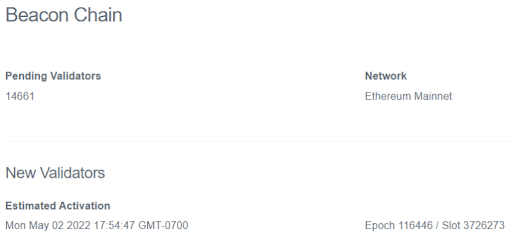

The **screenshot** above was taken on **04/16/2022**, indicating a deposit into the ETH 2.0 staking contract on that day will incur a wait time to activation of roughly 16 days. This means once you queue your validator to join the network (by depositing your 32 ETH) it won’t be eligible to participate in staking or to earn staking rewards until it is activated.

<ins>**NOTE:**</ins> As stated at the beginning of this guide, **DO NOT** deposit ETH without understanding what you are doing. **DO NOT** send ETH to the ETH 2.0 deposit contract without following the detailed instructions in this guide.

# Overview

The simplified diagram below indicates the scope of this guide. The yellow boxes are the areas this guide mostly covers.

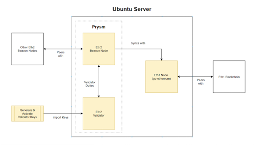

The conceptual flow for the setup process of ETH staking validator nodes is:

* Generate the staking Validator Keys and Deposit Data
* Prepare the Ubuntu Server (firewall, security, etc.)
* Set up an Eth1 Node and sync it with the Eth1 Blockchain
* Configure the Prysm client and sync it with the Eth1 Node
* Deposit ETH to Activate Validator Keys

# Step 1 — Generate Staking Data

In order to participate in staking it is necessary to generate some data files based on the number of validators, you’d like to fund and operate.

<ins>**NOTE:**</ins> If you have already generated your deposit data and validator key(s) you can skip this step.

Each validator requires a deposit of 32 ETH. You should have sufficient ETH in your MetaMask wallet to fund each validator. For example, if you plan to run 5 validators you will need to have (32 x 5) = 160 ETH plus some extra to cover the gas fees. The ETH deposit will happen later in the guide after everything else is up and running.

**Download the Deposit Tool (Deposit CLI)**

Go [<ins>here</ins>](https://github.com/ethereum/eth2.0-deposit-cli/releases/) to get the “Latest release” of the deposit command line interface (CLI) app.

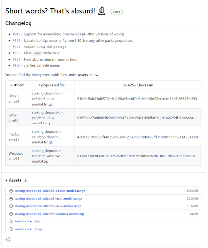

In the Assets section, download the version matching the platform you are currently on (e.g. Windows, Mac, Linux Desktop, etc.).

**Run the Deposit Tool (Eth2 Deposit CLI)**

**Decompress the archive.**

There should be a binary file (executable) inside. The deposit tool generates files for staking as well as a mnemonic key. This key must be handled securely. There are two options to proceed from here.

_**Recommended**_ — Copy the binary file to a USB drive. Connect to a fully air-gapped machine (never previously connected to the internet), copy the file over, and run from there.

_**Not recommended**_ — Run from the current machine. An internet connection may be an opportunity to leak your mnemonic key. If a fully air-gapped machine isn’t available disconnect the internet on the current machine before proceeding.

When ready, run the file in a terminal window (or CMD in windows) to continue using the commands below. Replace `<NumberOfValidators>` with the number of validators you want to fund. E.g. `--num_validators 2`.

**On Linux/Mac:**

```
./deposit new-mnemonic --num_validators <NumberOfValidators> --chain mainnet
```

**On Windows:**

```
deposit.exe new-mnemonic --num_validators <NumberOfValidators> --chain mainnet
```

Once you execute the above steps on your platform of choice you will be asked to create a validator keystore password. Back it up somewhere safe. You will need this later to load the validator keys into the Prysm validator wallet.

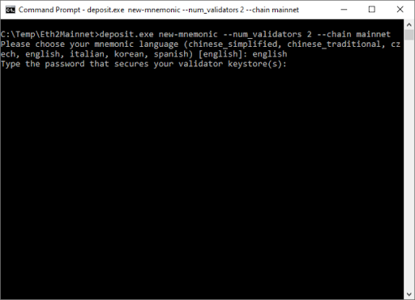

A seed phrase (mnemonic) will be generated. Back it up somewhere safe. This is **CRITICAL**. You will eventually use this to generate your withdrawal keys for your ETH or add additional validators. <ins>If you lose this key you will not be able to withdraw your funds</ins>.

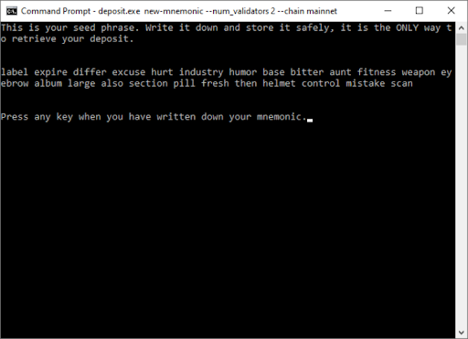

Once you have confirmed your mnemonic, your validator keys will be created.

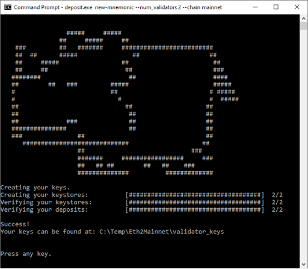

The newly created validator keys and deposit data file are created at the specified location. The contents of the folder are shown below.

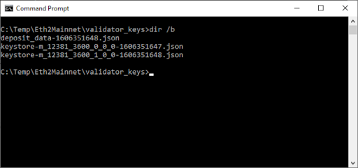

**Notes about the files:**

* `The deposit_data-[timestamp].json` file contains the public keys for the validators and information about the staking deposit. This file will be used to complete the ETH deposit process later on.
* The `keystore-m...json` files contain the encrypted validator signing key. There is one keystore-m per validator that you are funding. These will be imported into the Prysm validator wallet for use while staking. You will copy these files over to the Ubuntu server (if not already there) later.

**Final Steps**

Now that you have the deposit data and the keystore files move on to set up the Ubuntu server.

<ins>**DO NOT DEPOSIT any ETH at this moment.**</ins>

It is important to complete and verify your staking setup first. If the ETH deposits become active and your staking setup is not ready you will start receiving penalties for non-activity.

# Step 2 — Connect to the Server

Using an SSH client, connect to your Ubuntu server. If you are logged in as `root` then create a user-level account with admin privileges instead, since logging in as the root user is [<ins>risky</ins>](https://askubuntu.com/questions/16178/why-is-it-bad-to-log-in-as-root).

<ins>**NOTE:**</ins> If you are not logged in as `root` then skip this and go to Step 3.

**Create a new user.** Replace `<yourusername>` with a username of your choice. You will be asked to create a strong password and provide some other optional information.

```
# adduser <yourusername>
```

**Grant admin rights to the new user** by adding it to the sudo group. This will allow the user to perform actions with superuser privileges by typing sudo before commands.

```
# usermod -aG sudo <yourusername>
```

<ins>Optional:</ins> If you used [<ins>SSH</ins>](https://jumpcloud.com/blog/what-are-ssh-keys) keys to connect to your Ubuntu instance via the `root` user you will need to associate the new user with the root user’s SSH key data.

```
# rsync --archive --chown=<yourusername>:<yourusername> ~/.ssh /home/<yourusername>
```

**Finally, log out of `root` and log in as `<yourusername>`.**

# Step 3 — Update the Server

Make sure the system is up to date with the latest software and security updates.

```
$ sudo apt update && sudo apt upgrade
$ sudo apt dist-upgrade && sudo apt autoremove
$ sudo reboot
```

# Step 4 — Secure the Server

**Security is important.** This is not a comprehensive security guide, just some basic settings.

**Modify** the Default SSH Port

Port 22 is the default SSH port and a common attack vector. Change the SSH port to avoid this.

**Choose** a port number between 1024–49151 and run the following command to check is not already in use. A blank response indicates not in use, a red text response indicates it is in use: try a different port. E.g. `sudo ss -tulpn | grep ':6673'`

```
$ sudo ss -tulpn | grep ':<YourSSHPortNumber>'
```

If confirmed available, modify the default port by updating SSH config.

```
$ sudo nano /etc/ssh/sshd_config
```

Find or add (if not present) the line `Port 22` in the file. Remove the `#` (if present) and change the value as below.

```
Port <YourSSHPortNumber>
```

Check the screen shot below for reference. Press CTRL+x then ‘y’ then <enter> to save and exit.

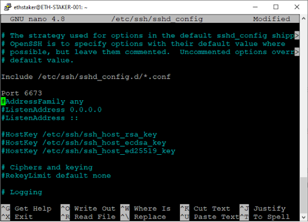

**Restart** the SSH service to reflect the above changes.

```
$ sudo systemctl restart ssh
```

**Log out and log back in** via SSH using `<YourSSHPortNumber>` for the port.

**Configure the Firewall**

Ubuntu 20.04 servers can use the default [<ins>UFW firewall</ins>](https://help.ubuntu.com/community/UFW) to restrict inbound traffic to the server. Before you enable it allow inbound traffic for SSH, Go Ethereum, and Prysm.

**Install UFW**

UFW should be installed by default. The following command will ensure it is.

```
$ sudo apt install ufw
```

**Apply UFW Defaults**

Explicitly apply the defaults. Inbound traffic denied, outbound traffic allowed.

```
$ sudo ufw default deny incoming
$ sudo ufw default allow outgoing
```

**Allow SSH**

Allow inbound traffic on `<YourSSHPortNumber>` as set above. SSH requires the TCP protocol. E.g. `sudo ufw allow 6673/tcp`

```
$ sudo ufw allow <yourSSHportnumber>/tcp
```

**Deny SSH Port 22**

Deny inbound traffic on port 22/TCP.

<ins>**NOTE:**</ins> Only do this after you SSH in using `<YourSSHPortNumber>`.

```
$ sudo ufw deny 22/tcp
```

**Allow Go Ethereum**

Allow P2P connections with Go Ethereum peers (port 30303). If using an Eth1 node hosted by a [<ins>3rd party</ins>](https://ethereumnodes.com/) then skip this step.

<ins>**NOTE:**</ins> If you are hosting your Ubuntu instance locally your internet router may need to be [<ins>configured</ins>](https://www.howtogeek.com/66214/how-to-forward-ports-on-your-router/) to allow incoming traffic on port 30303 as well.

```
$ sudo ufw allow 30303
```

**Allow Prysm**

Allows P2P connections with Prysm peers for actions on the beacon node (ports 13000/TCP and 12000/UDP).

<ins>**NOTE:**</ins> If you are hosting your Ubuntu instance locally your internet router may need to be [<ins>configured</ins>](https://www.howtogeek.com/66214/how-to-forward-ports-on-your-router/) to allow incoming traffic on ports 13000 and 12000 as well.

```
$ sudo ufw allow 13000/tcp
$ sudo ufw allow 12000/udp
```

**Enable** the firewall and verify the rules have been correctly configured.

```
$ sudo ufw enable
$ sudo ufw status numbered
```

Check the screen shot below for reference.

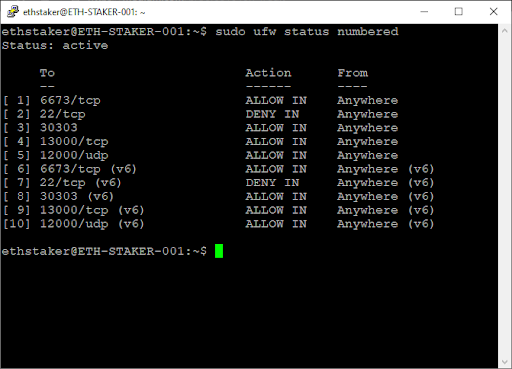

# Step 5 — Configure Timekeeping

Ubuntu has time synchronization built in and activated by default using systemd’s timesyncd service. Verify it’s running correctly.

```
$ timedatectl
```

The `NTP service` should be `active`. If not then run:

```
$ sudo timedatectl set-ntp on
```

**Check the screen shot below for reference.**

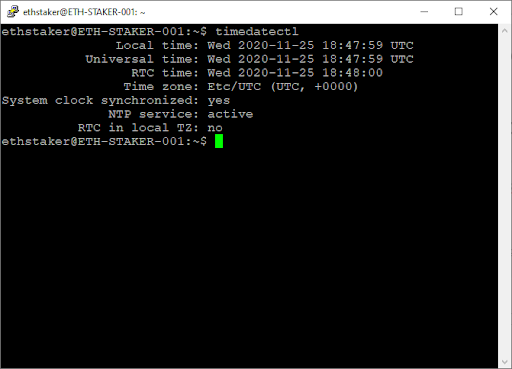

You should only be using a single keeping service. If you were using NTPD from a previous installation you can check if it exists and remove it using the following commands.

```
$ ntpq -p
$ sudo apt-get remove ntp
```

# Step 6 — Set up The Execution Layer Client

An Execution layer client is required for staking. This guide will provide instructions for running [<ins>Go Ethereum</ins>](https://geth.ethereum.org/). If you would rather use a [<ins>third</ins>](https://ethereumnodes.com/) party option then skip this step.

<ins>**NOTE:**</ins> Check your available disk space. An execution layer client requires roughly 400GB of space. Even you have a large SSD there are cases where Ubuntu is reporting only 200GB free. If this applies to you then take a look at **Appendix F — Expanding the Logical Volume**.

**Install Go Ethereum:**

Install the Go Ethereum client using PPA’s (Personal Package Archives).

```
$ sudo add-apt-repository -y ppa:ethereum/ethereum
$ sudo apt update
$ sudo apt install geth
```

Go Ethereum will be configured to run as a background service. Create an account for the service to run under. This type of account can’t log into the server.

```
$ sudo useradd --no-create-home --shell /bin/false goeth
```

Create the data directory for the Eth1 chain. This is required for storing the Eth1 node data.

```
$ sudo mkdir -p /var/lib/goethereum
```

Set directory permissions. The `goeth` account needs permission to modify the data directory.

```
$ sudo chown -R goeth:goeth /var/lib/goethereum
```

Create a systemd service config file to configure the service.

```
$ sudo nano /etc/systemd/system/geth.service
```

Paste the following service configuration into the file.

```
[Unit]
Description=Go Ethereum Client
After=network.target
Wants=network.target
[Service]
User=goeth
Group=goeth
Type=simple
Restart=always
RestartSec=5
ExecStart=geth --http --datadir /var/lib/goethereum --cache 2048 --maxpeers 30
[Install]
WantedBy=default.target
```

**Notable [<ins>flags</ins>](https://geth.ethereum.org/docs/interface/command-line-options):**

`--http` Expose an HTTP endpoint (http://localhost:8545) that the Prysm beacon node will connect to.

`--cache` Size of the internal cache in GB. Reduce or increase depending on your available system memory. A setting of `2048` results in roughly 4–5GB of memory usage.

`--maxpeers` Maximum number of peers to connect with. More peers equals more internet data usage. Do not set this too low or your Eth1 node will struggle to stay in sync.

**Check the screen shot below for reference. Press CTRL+x then ‘y’ then <enter> to save and exit.**

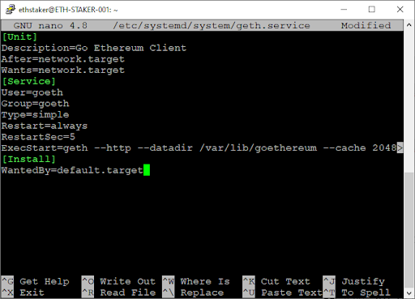

Reload systemd to reflect the changes and start the service. **Check status** to make sure it’s running correctly.

```
$ sudo systemctl daemon-reload
$ sudo systemctl start geth
$ sudo systemctl status geth
```

**Check the screen shot below for reference.**

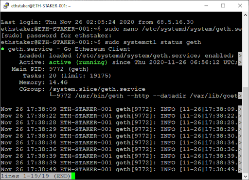

It should say _**active (running)**_ in green text. If not then go back and repeat the steps to fix the problem. Press **Q** to quit (will not affect the geth service).

**Enable** the geth service to automatically start on reboot.

```
$ sudo systemctl enable geth
```

The Go Ethereum node will begin to sync. You can follow the progress or check for errors by running the following command. Press CTRL+c to exit (will not affect the geth service).

```
$ sudo journalctl -fu geth.service
```

Check the screen shot below for reference.

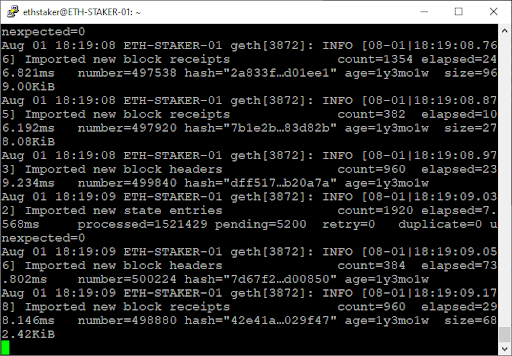

**Check Sync Status**

To check your Eth1 node [<ins>sync status</ins>](https://www.ipaddressguide.org/how-long-time-does-it-take-to-synchronize-an-ethereum-node/) use the following command to access the console.

```
geth attach http://127.0.0.1:8545
> eth.syncing
```

If `false` is returned then your sync is complete. If syncing data is returned then you are still syncing. For reference there are roughly 700 million `knownStates`.

**Check the screen shot below for reference.**

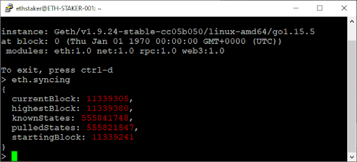

**Press CTRL+d to exit when done.**

**Check Connected Peers**

To check your Eth1 node connected peers use the following command to access the console.

```
geth attach http://127.0.0.1:8545
> net.peerCount
```

The `peerCount` will not exceed your setting for `--maxpeers`.

If you are having trouble finding peers to sync see the next section.

**Press CTRL+d to exit when done.**

**Add Bootnodes (Optional)**

Sometimes it can take a while to find peers to sync. If so, you can add some bootnodes to help things along. Go [here](https://gist.github.com/rfikki/a2ccdc1a31ff24884106da7b9e6a7453) for the latest list and modify the geth service as follows:

```
$ sudo systemctl stop geth
$ sudo nano /etc/systemd/system/geth.service
```

**Modify** the ExecStart line and add the `--bootnodes` flag with a few of the latest peers, comma separated.

```
ExecStart=geth --http --datadir /var/lib/goethereum --cache 2048 --maxpeers 30 --bootnodes "enode://d0b4a09d072b3f021e233fe55d43dc404a77eeaed32da9860cc72a5523c90d31ef9fab7f3da87967bc52c1118ca3241c0eced50290a87e0a91a271b5fac8d0a6@157.230.142.236:30303,enode://5070366042daaf15752fea340e7ffce3fd8fc576ac846034bd551c3eebac76db122a73fe8418804c5070a5e6d690fae133d9953f85d7aa00375d9a4a06741dbc@116.202.231.71:30303"
```

**Save the file and exit. Restart the service and observe.**

```
$ sudo systemctl daemon-reload
$ sudo systemctl start geth
$ sudo journalctl -fu geth.service
```

<ins>**NOTE:**</ins>
- It is necessary to follow a specific series of steps to update Geth. See Appendix A — Updating Geth for further information.
- From time-to-time it is necessary to “prune” Geth’s database to keep its size on disk as small as possible. See Appendix D — Pruning Geth for further information.

# Step 7 — Download Prysm

The Prysm client is made up of two binary files — the beacon node and the validator Client. This step will download and prepare the Prysm binaries.

**First**, go [<ins>here</ins>](https://github.com/prysmaticlabs/prysm/releases) and identify the latest release. It is at the top of the page. For example:

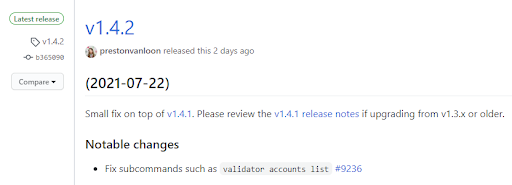

In the assets section (expand if necessary) copy the download link to the **beacon-chain-v…-linux-amd64** file and the **validator-v…-linux-amd64** file. Be sure to copy the correct link.

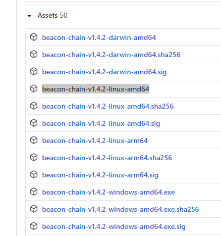

**Download** the files using the commands below. **Modify** the URL in the instructions below to match the download link for the latest version.

```
$ cd ~
$ sudo apt install curl
$ curl -LO https://github.com/prysmaticlabs/prysm/releases/download/v1.4.2/beacon-chain-v1.4.2-linux-amd64
$ curl -LO https://github.com/prysmaticlabs/prysm/releases/download/v1.4.2/validator-v1.4.2-linux-amd64
```

**Rename** the files and make them executable. **Copy** them to the `/usr/local/bin` directory. The Prysm services will run them from there. **Modify** the file name as necessary.

```
$ mv beacon-chain-v1.4.2-linux-amd64 beacon-chain
$ mv validator-v1.4.2-linux-amd64 validator
$ chmod +x beacon-chain
$ chmod +x validator
$ sudo cp beacon-chain /usr/local/bin
$ sudo cp validator /usr/local/bin
```

**Clean up the downloaded files.**

```
$ cd ~
$ sudo rm beacon-chain && sudo rm validator
```

<ins>**NOTE:**</ins> It is necessary to follow a specific series of steps to update Prysm. See **Appendix B — Updating Prysm** for further information.

# Step 8 — Import the Validator Keys

**Configure** the Prysm validator wallet by importing the validator keys you created in Step 1.

**Copy the Validator Keystore Files**

If you generated the validator `keystore-m…json` file(s) on a machine other than your Ubuntu server you will need to copy the file(s) over to your home directory. You can do this using a USB drive (if your server is local), or via [<ins>secure FTP (SFTP)</ins>](https://www.maketecheasier.com/use-sftp-transfer-files-linux-servers/).

**Place** the files here: `$HOME/eth2deposit-cli/validator_keys`. (Create the directories if necessary)

**Import Keystore Files into the Validator**

Create a directory to store the validator wallet data and give the current user permission to access it. The current user needs access because they will be performing the import. Change `<yourusername>` to the logged in username.

```
$ sudo mkdir -p /var/lib/prysm/validator
$ sudo chown -R <yourusername>:<yourusername> /var/lib/prysm/validator
```

**Run** the validator key import process. You will need to provide the directory where the generated keystore-m files are located. E.g.

```
$HOME/eth2deposit-cli/validator_keys.
$ cd /usr/local/bin
$ validator accounts import --keys-dir=$HOME/eth2deposit-cli/validator_keys
```

You will be presented with [<ins>terms of use</ins>](https://github.com/prysmaticlabs/prysm/blob/master/TERMS_OF_SERVICE.md) which you will need to `accept` to continue.

You will need to provide a **wallet directory**. This is where your new wallet will be created. **Use** `/var/lib/prysm/validator`.

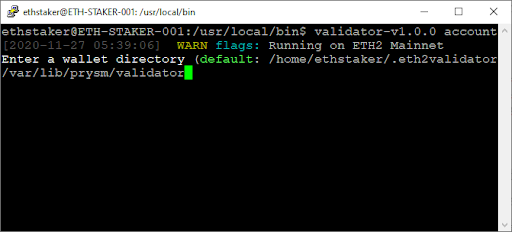

You will need to create a **wallet password**. **Back it up somewhere safe**. You will need this later when configuring the validator.

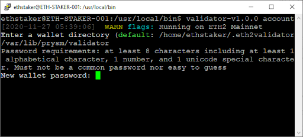

You will need to provide the validator keys password. This is the password you set when you created the keys during Step 1.

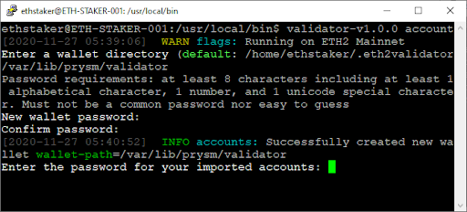

If you enter it correctly the keys will be imported.

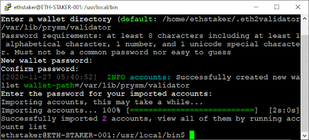

**Create a Wallet Password File**

Create a file to store the **wallet password** so the Prysm validator service can access the wallet without you having to supply the password. The file will be named password.txt.

```
$ sudo nano /var/lib/prysm/validator/password.txt
```

**Add** your new **wallet password** to the file. Replace `YourNewWalletPassword` with your password.

**Check the screen shot below for reference. Press CTRL+x then ‘y’ then <enter> to save and exit.**

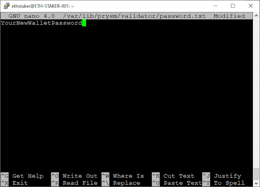

Permissions on the validator directory and password file will be set later in the guide.

The import is complete and the wallet is now set up.

<ins>**NOTE:**</ins> It is necessary to follow a specific series of steps to add an additional validator. See Appendix C — Adding a Validator for further information

# Step 9 — Configure the Prysm Beacon Node

In this step you will configure and run the beacon node as a service so if the system restarts the process will automatically start back up again.

**Set up the Account and Directory**

Create an account for the beacon node to run under. This type of account can’t log into the server.

```
$ sudo useradd --no-create-home --shell /bin/false prysmbeacon
```

Create the data directory for the beacon node database and set permissions.

```
$ sudo mkdir -p /var/lib/prysm/beacon
$ sudo chown -R prysmbeacon:prysmbeacon /var/lib/prysm/beacon
$ sudo chmod 700 /var/lib/prysm/beacon
$ ls -dl /var/lib/prysm/beacon
```

**Check the screen shot below for reference.**

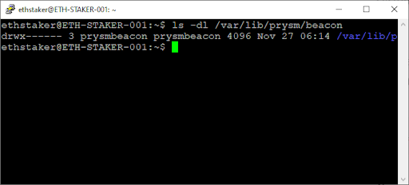

**Create and Configure the Service**

Create a systemd service config file to configure the service.

```
$ sudo nano /etc/systemd/system/prysmbeacon.service
```

**Paste the following into the file.**

```
[Unit]
Description=Prysm Eth2 Client Beacon Node
Wants=network-online.target
After=network-online.target
[Service]
User=prysmbeacon
Group=prysmbeacon
Type=simple
Restart=always
RestartSec=5
ExecStart=/usr/local/bin/beacon-chain --datadir=/var/lib/prysm/beacon --http-web3provider=http://127.0.0.1:8545 --accept-terms-of-use
[Install]
WantedBy=multi-user.target
```

**Notable [<ins>flags</ins>](https://docs.prylabs.network/docs/prysm-usage/parameters):**

`--http-web3provider` Change the value if you are using a remote or third party Eth1 node. **If you created the Eth1 node locally no change is required.**

`--fallback-web3provider` (not shown) This optional flag can be used in conjuction with the `--http-web3provider` flag to specify a 3rd party fallback Eth1 node in case your main Eth1 node goes down. Multiple options can be added by repeating the flag. More information [<ins>here</ins>](https://docs.prylabs.network/docs/prysm-usage/setup-eth1/#authorizing-connection-to-a-third-party-eth1-provider) and a list of 3rd party options [<ins>here</ins>](https://ethereumnodes.com/). For example:

```
ExecStart=/usr/local/bin/beacon-chain --datadir=/var/lib/prysm/beacon --http-web3provider=http://127.0.0.1:8545 --fallback-web3provider=https://3rdPartyProviderURL --accept-terms-of-use
--accept-terms-of-use
```

Required to automatically start the service. Using this flag indicates acceptance of the Prysm [<ins>terms of use</ins>](https://github.com/prysmaticlabs/prysm/blob/master/TERMS_OF_SERVICE.md).

**Check the screen shot below for reference. Press CTRL+x then ‘y’ then <enter> to save and exit.**

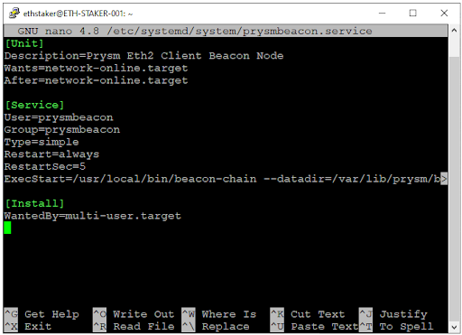

**Reload** systemd to reflect the changes.

```
$ sudo systemctl daemon-reload
```

**Start** the service and check to make sure it’s running correctly.

```
$ sudo systemctl start prysmbeacon
$ sudo systemctl status prysmbeacon
```

**Check the screen shot below for reference**

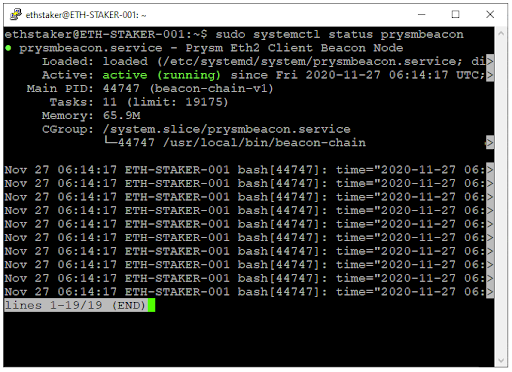

If you did everything right, it should say _**active (running)**_ in green text. If not then go back and repeat the steps to fix the problem.

Press **Q** to quit (will not affect the prysmbeacon service).

**Enable the service to automatically start on reboot.**

```
$ sudo systemctl enable prysmbeacon
```

If the Eth2 chain is post-genesis the Prysm beacon chain will begin to sync. It may take several hours to fully sync. You can follow the progress or check for errors by running the `journalctl` command. Press CTRL+c to exit (will not affect the prysmbeacon service).

```
$ sudo journalctl -fu prysmbeacon.service
```

A truncated view of the log shows the following status information.

```
Nov 27 06:20:48 ETH-STAKER-001 bash[44829]: time="2020-11-27 06:20:48" level=info msg="Processing deposits from Ethereum 1 chain" deposits=1024 genesisValidators=1019 prefix=powchain
```

Once the Eth2 mainnet starts up the beacon chain and validator will automatically start processing.

<ins>**NOTE:**</ins> If your Eth1 node is still syncing you will get the following error. It will disappear once the sync is complete.

```
Nov 27 06:16:29 ETH-STAKER-001 bash[44747]: time="2020-11-27 06:16:29" level=error msg="Could not connect to powchain endpoint" error="could not dial eth1 nodes: eth1 node using incorrect chain id, 0 != 1" prefix=powchain
```

# Step 10 — Configure the Prysm Validator Client

In this step you will configure and run the validator client as a service so if the system restarts the process will automatically start back up again.

**Set up the Account and Directory**

Create an account for the validator client to run under. This type of account can’t log into the server.

```
$ sudo useradd --no-create-home --shell /bin/false prysmvalidator
```

The data directory for the validator was created in Step 8. Now set permissions so the `prysmvalidator` account can modify the data directory.

```
$ sudo chown -R prysmvalidator:prysmvalidator /var/lib/prysm/validator
$ sudo chmod 700 /var/lib/prysm/validator
$ ls -dl /var/lib/prysm/validator
```

**Check the screen shot below for reference.**

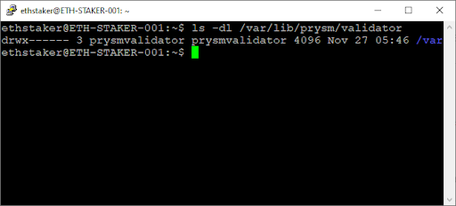

The password.txt file for the validator walled was created in Step 8. Now set permissions so only the `prysmvalidator` account can read the file.

```
$ sudo chmod -R 700 /var/lib/prysm/validator/password.txt
$ sudo ls -lh /var/lib/prysm/validator/
```

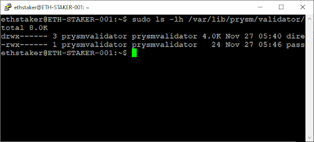

**Create and Configure the Service**

Create a systemd service config file to configure the service.

```
$ sudo nano /etc/systemd/system/prysmvalidator.service
```

**Paste the following into the file.**

```
[Unit]
Description=Prysm Eth2 Validator Client
Wants=network-online.target
After=network-online.target
[Service]
User=prysmvalidator
Group=prysmvalidator
Type=simple
Restart=always
RestartSec=5
ExecStart=/usr/local/bin/validator --datadir=/var/lib/prysm/validator --wallet-dir=/var/lib/prysm/validator --wallet-password-file=/var/lib/prysm/validator/password.txt --graffiti="<yourgraffiti>" --accept-terms-of-use
[Install]
WantedBy=multi-user.target
```

**Notable [<ins>flags</ins>](https://docs.prylabs.network/docs/prysm-usage/parameters):**

`--graffiti="<yourgraffiti>"` Replace with your own graffiti string. For security and privacy reasons avoid information that can uniquely identify you. E.g. `--graffiti "Hello Eth2! From Dominator"`.

**Check the screen shot below for reference. Press CTRL+x then ‘y’ then <enter> to save and exit.**

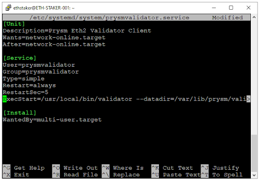

**Reload systemd to reflect the changes.**

```
$ sudo systemctl daemon-reload
```

**Start the service and check to make sure it’s running correctly.**

```
$ sudo systemctl start prysmvalidator
$ sudo systemctl status prysmvalidator
```

**Check the screen shot below for reference.**

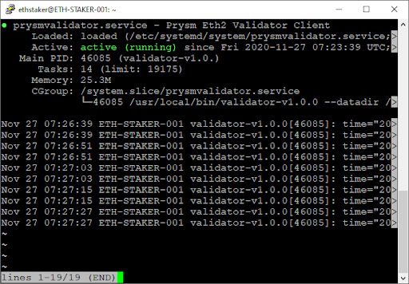

If you did everything right, it should say _**active (running)**_ in green text. If not then go back and repeat the steps to fix the problem. Press **Q** to quit (will not affect the prysmvalidator service).

**Enable the service to automatically start on reboot.**

```
$ sudo systemctl enable prysmvalidator
```

You can follow the progress or check for errors by running the `journalctl` command. Press CTRL+c to exit (will not affect the prysmvalidator service).

```
$ sudo journalctl -fu prysmvalidator.service
```

A truncated view of the log shows the following status information.

```
ETH-STAKER-001 systemd[1]: Started Prysm Eth2 Validator Client.
level=warning msg="Running on ETH2 Mainnet" prefix=flags
level=info msg="Opened validator wallet" keymanager-kind=direct level=info msg="Checking DB" databasePath="/var/lib/prysm/validator" level=info msg="Starting validator node" prefix=node
…
level=info msg="Validating for public key" prefix=validator publicKey=0x9072a8f02c18
level=info msg="Validating for public key" prefix=validator publicKey=0xaa5ff8b63560
level=info msg="Waiting for beacon chain start log from the ETH 1.0 deposit contract" prefix=validator
level=info msg="Beacon chain started" genesisTime=2020-12-01 12:00:23 +0000 UTC prefix=validator
level=info msg="Waiting for deposit to be observed by beacon node" prefix=validator pubKey=0x9072a8f02c18 status="UNKNOWN_STATUS"
```

You can check the status of your validator(s) via [<ins>beaconcha.in</ins>](https://beaconcha.in/).

Simply search for your validator public key(s) or search using your MetaMask (or other) wallet address. It may be a while before the data appears on the site.

# Step 11 — Fund the Validator Keys

Now that your set up is up and running you will need to deposit ETH to fund your validators.

<ins>**NOTE:**</ins>
- If you have already submitted your staking deposits you can skip this step. This step involves depositing the required amount of ETH to the Eth2.0 deposit contract. DO NOT SEND ETH TO THE DEPOSIT CONTRACT. This is done in a web browser running your MetaMask (or other) wallet via the Eth2.0 Launchpad website.
- Post-genesis, wait until your Eth1 node and beacon chain have fully synced before proceeding with the deposit. If you don’t Prysm will be inactive while the Eth1 node or beacon chain sync and you may be subject to inactivity penalties.

Go here: <ins>https://launchpad.ethereum.org/</ins>

Click through the warning steps and continue through the screens until you get to the Generate Key Pairs section. Select the number of validators you are going to run. Choose a value that matches the number of validator files you generated in **Step 1**.

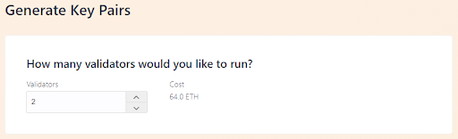

Scroll down, check the box if you agree, and click Continue.


You will be asked to upload the `deposit_data-[timestamp].json` file. You generated this file in **Step 1**. **Browse/select** or drag the file and click Continue.

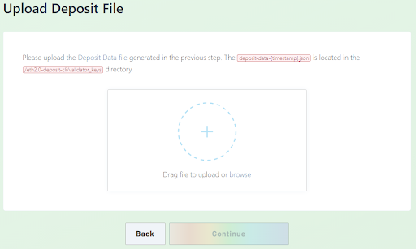

**Connect** your wallet. **Choose** MetaMask (or one of the other supported wallets), log in, select the account where you have your ETH and click Continue.

Your MetaMask balance will be displayed. The site will allow you to continue if you have selected Mainnet and you have sufficient ETH balance.

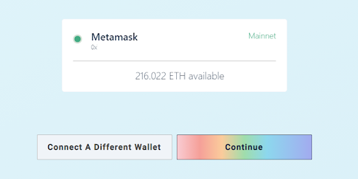

A summary shows the number of validators and total amount of ETH required. **Tick** the boxes if you agree and click continue.

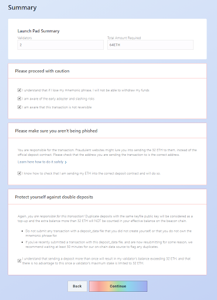

If you are ready to deposit click on Initiate All Transactions.

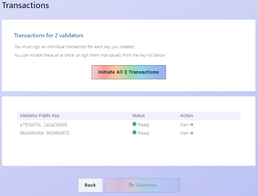

This will pop open MetaMask (or other wallet) where you can confirm each transaction.

Once all the transactions have successfully completed, **you are done**!

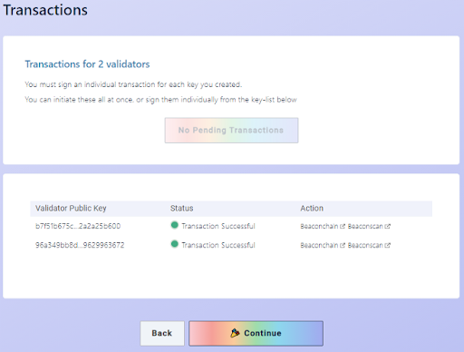

**Congratulations you have deposited your stake!**

**Check the Status of Your Validator Deposits**

Newly added validators can take a while (hours to days) to activate. You can check the status of your keys with these steps:

1. **Copy** your MetaMask (or other) wallet address.
2. Go here: <ins>https://beaconscan.com/</ins>
3. **Search** for your key(s) using your wallet address.

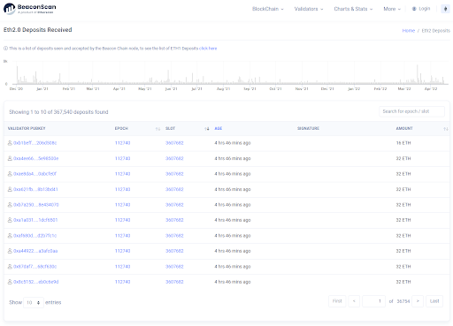

Diving into a specific validator you see a Status and an estimate until activation (Activation Epoch) for the validator.

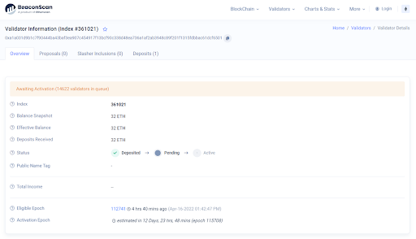

You now have a functioning beacon chain and validator and your mainnet deposit is in. Once your deposit is active and the Ethereum 2.0 mainnet is running you will begin staking and earning rewards.

<p align="center">
  <b>Congratulations: You are officially an Ethereum Staker!</b>
</p>

<p align="center">
  (Probably a good time to get a fresh beverage and hydrate)
</p>

# Step 12 — Monitoring

Due to a few unresolved security concerns monitoring will be a near-future addition to this guide.

In the meantime, there is a monitoring option offered by [<ins>beaconcha.in</ins>](https://kb.beaconcha.in/beaconcha.in-explorer/mobile-app-less-than-greater-than-beacon-node).

# Final Remarks and Recommended Next Steps

_**Thanks for the opportunity. Hopefully this guide was helpful for you.**_

**Next steps:**

* Triple **check** all key and password backups.
* **Reboot** your machine and make sure the services come back up.
* **Understand** how to update the client and server software.
* **Consider** setting a max size for systemd journal logs. See Appendix F.
* **Use** `htop` to monitor resources on the local machine.
* Get familiar with [<ins>beaconcha.in</ins>](https://beaconcha.in/) so you can monitor your validators. They offer alerting (via email — sign up required) and [<ins>monitoring</ins>](https://kb.beaconcha.in/beaconcha.in-explorer/mobile-app-less-than-greater-than-beacon-node).
* **Join** the [<ins>Ethstaker</ins>](https://discord.gg/7z8wzehjrJ) and [<ins>Prysm</ins>](https://discord.gg/VaQcHq76yJ) Discord for important notifications.
* **Share** any feedback for this guide on [<ins>Discord</ins>](https://discord.gg/7z8wzehjrJ), [<ins>Twitter</ins>](https://www.twitter.com/SomerEsat), or [<ins>Reddit</ins>](https://www.reddit.com/user/SomerEsat).
* **Help** others with their setup on the [<ins>Ethstaker</ins>](https://discord.gg/7z8wzehjrJ) discord.
* **Share** this guide using the [<ins>friend link</ins>](https://someresat.medium.com/guide-to-staking-on-ethereum-2-0-ubuntu-prysm-56f681646f74?sk=b61691b713d37802b8345855dc356b02)!
* **Tips**: somer.eth

# Further Reading

It is **strongly** recommended that you evaluate information from as many sources as possible.

These are additional resources to help familiarize yourself with staking on Eth2.

The author has not tested or verified these resources. Use at your own risk.

* Client team official documentation [<ins>Prysm</ins>](https://docs.prylabs.network/docs/getting-started) | [<ins>Lighthouse</ins>](https://lighthouse-book.sigmaprime.io/) | [<ins>Teku</ins>](https://docs.teku.consensys.net/en/latest/) | [<ins>Nimbus</ins>](https://status-im.github.io/nimbus-eth2/intro.html)
* [<ins>/r/EthStaker Sticky</ins>](https://www.reddit.com/r/ethstaker/comments/jjdxvw/welcome_to_rethstaker_the_home_for_ethereum/)
* [<ins>Unofficial docker environment for Ethereum 2.0 clients</ins>](https://github.com/eth2-educators/eth2-docker)
* [<ins>Setup an Eth2 Mainnet Validator System on Ubuntu</ins>](https://github.com/metanull-operator/eth2-ubuntu)
* [<ins>Guide | How to setup a validator on ETH2 mainnet</ins>](https://www.coincashew.com/coins/overview-eth/guide-or-how-to-setup-a-validator-on-eth2-mainnet)
* [<ins>Guide | Security Best Practices for a ETH2 validator beaconchain node</ins>](https://www.coincashew.com/coins/overview-eth/guide-or-security-best-practices-for-a-eth2-validator-beaconchain-node)
* [<ins>Additional Monitoring for ETH2 Staking Nodes</ins>](https://moody-salem.medium.com/additional-monitoring-for-eth2-staking-nodes-aea05b2f9a86)
* [<ins>Telegram Service for Ethereum 2.0 Staking</ins>](https://9elements.com/blog/ethereum-2-0-2/)

## Appendix A — Updating Geth

If you need to update to the latest version of Geth follow these steps.

```
$ sudo systemctl stop prysmvalidator
$ sudo systemctl stop prysmbeacon
$ sudo systemctl stop geth
$ sudo apt update && sudo apt upgrade
$ sudo systemctl start geth
$ sudo systemctl status geth # <-- Check for errors
$ sudo journalctl -fu geth.service # <-- Monitor
$ sudo systemctl start prysmbeacon
$ sudo systemctl status prysmbeacon # <-- Check for errors
$ sudo journalctl -fu prysmbeacon.service # <-- Monitor
$ sudo systemctl start prysmvalidator
$ sudo systemctl status prysmvalidator # <-- Check for errors
$ sudo journalctl -fu prysmvalidator.service # <-- Monitor
```

## Appendix B — Updating Prysm

If you need to update to the latest version of Prysm follow these steps.

First, go [<ins>here</ins>](https://github.com/prysmaticlabs/prysm/releases) and identify the latest Linux release. In the assets section (expand if necessary) copy the download link to the **beacon-chain-v…-linux-amd64** file and the **validator-v…-linux-amd64** file. Be sure to copy the correct link.

**Modify** the URL in the instructions below to match the download link for the latest version.

```
$ cd ~
$ sudo apt install curl
$ curl -LO https://github.com/prysmaticlabs/prysm/releases/download/v1.4.2/beacon-chain-v1.4.2-linux-amd64
$ curl -LO https://github.com/prysmaticlabs/prysm/releases/download/v1.4.2/validator-v1.4.2-linux-amd64
```

**Stop** the Prysm services.

```
$ sudo systemctl stop prysmvalidator
$ sudo systemctl stop prysmbeacon
```

**Rename** the files and make them executable. Copy them to the `/usr/local/bin` directory. Modify the file names below as necessary.

```
$ mv beacon-chain-v1.4.2-linux-amd64 beacon-chain
$ mv validator-v1.4.2-linux-amd64 validator
$ chmod +x beacon-chain
$ chmod +x validator
$ sudo cp beacon-chain /usr/local/bin
$ sudo cp validator /usr/local/bin
```

**Restart** the services and check for errors.

```
$ sudo systemctl daemon-reload
$ sudo systemctl start prysmbeacon
$ sudo systemctl status prysmbeacon # <-- Check for errors
$ sudo journalctl -fu prysmbeacon.service # <-- Monitor
$ sudo systemctl start prysmvalidator
$ sudo systemctl status prysmvalidator # <-- Check for errors
$ sudo journalctl -fu prysmvalidator.service # <-- Monitor
```

**Clean up the downloaded files.**

```
$ cd ~
$ sudo rm beacon-chain && sudo rm validator
```

## Appendix C — Adding a Validator

If you want to add one or more validators to your existing validator wallet use the following steps. Thanks to [<ins>Ryan Miller</ins>](https://twitter.com/real_Mills) for assistance with this section.

<ins>**NOTE:**</ins> This appendix assumes that you have already followed the guide and completed all of the steps.

Do not use this section to add validators to an empty validator wallet/incomplete setup.

**Check Validator Queue Times**

There may be a queue to activate a new validator on the ETH 2.0 mainnet. You can check current queue times by heading over here: <ins>https://eth2-validator-queue.web.app/</ins>

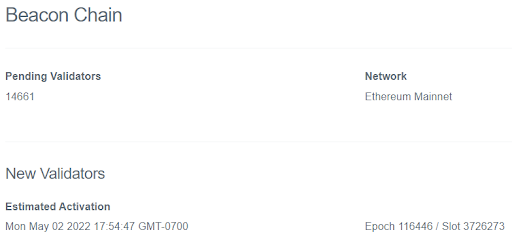

**Generate Deposit Data**

You will need to generate deposit data for your new validators. This will be used to add the new validators to your existing wallet.

Go [<ins>here</ins>](https://github.com/ethereum/eth2.0-deposit-cli/releases/) to get the “Latest release” of the deposit command line interface (CLI) app.

**Transfer** the binary to a USB stick and copy to an air-gapped machine for safety (recommended), or if not available, copy to a machine that is not connected to the net (not recommended).

When ready, run the file in a terminal window (or CMD in Windows) to continue using the commands below.

The `existing-mnemonic` command is used to re-generate or derive new keys from your existing mnemonic. You will need to supply your mnemonic phrase to do this, hence the security requirements.

**On Linux/Mac:**

```
./deposit existing-mnemonic --validator_start_index <ValidatorStartIndex> --num_validators
<NumberOfValidators> --chain mainnet
```

**On Windows:**

```
deposit.exe existing-mnemonic --validator_start_index <ValidatorStartIndex> --num_validators <NumberOfValidators> --chain mainnet
```

**Replace** `<ValidatorStartIndex>` with the start index of the new validator(s) you are adding. For example: If you have 3 existing validators (#0, #1, #2) and you want to add two more, you would specify `3` (being the next number in the sequence) as the start index. E.g. `--validator_start_index 3`.

<ins>**NOTE:**</ins> Double check the start index. Be sure you use the correct value.

**Replace** `<NumberOfValidators>` with the number of validators you want to fund. Each validator will require a 32 ETH deposit to fund. E.g. from the example above, we are adding two new validators: `--num_validators 2`.

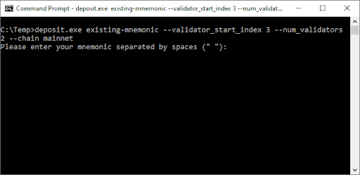

**Enter** your **mnemonic** that you should have stored safely after creating your initial validator(s).

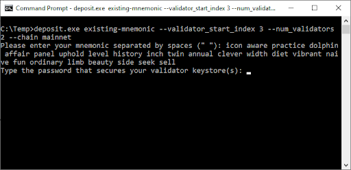

You will be asked to enter your **validator keystore** password. This password was set in **Step 1**. You can create a different password here, but it is recommended for simplicity to use the same password as the original keystore. Once you have confirmed your keystore password your validator keys will be created.

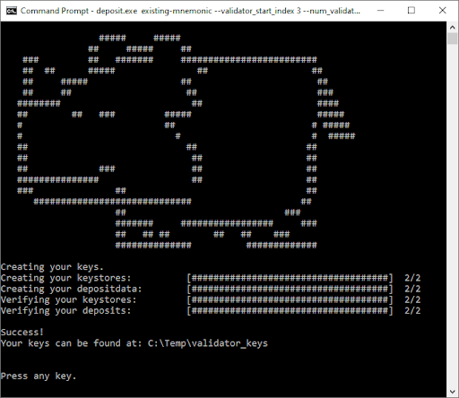

The newly created validator keys and deposit data file are created at the specified location.

The contents of the folder are shown below.

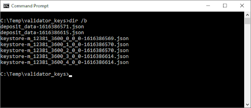

**Notes about the files:**

* The newer `deposit_data-[timestamp].json` file contains the public keys for the newly added validators and information about the staking deposit. This file will be used to complete the ETH deposit process later on.
* The newly created `keystore-m...json` files contain the encrypted validator signing key. There is one keystore-m per additional validator that you are funding. These will be imported into the Prism validator wallet for use while staking. You will copy these files over to the Ubuntu server (if not already there) later.

**_DO NOT_ DEPOSIT any ETH at this moment.**

It is important to complete and verify your staking setup first. If the ETH deposits become active and your staking setup is not ready you will start receiving penalties for non-activity. Let’s do that next.

**Copy the Validator Keystore Files**

If you generated the validator `keystore-m…json` file(s) on a machine other than your Ubuntu server you will need to **copy** the file(s) over to your home directory. You can do this using a USB drive (if your server is local), or via [<ins>secure FTP (SFTP)</ins>](https://www.maketecheasier.com/use-sftp-transfer-files-linux-servers/).

**Place** the files here: `$HOME/eth2deposit-cli/validator_keys`. Create the directories if necessary.

**Import Keystore Files into the Validator Wallet**

We are now ready to import the `keystore-m…json` file(s) into our existing validator wallet.

First stop the validator.

This is going to cause your validator to miss some attestations, but it is unavoidable. The loss of income is generally small.

```
$ sudo systemctl stop prysmvalidator
```

The current logged in user will need access to the validator wallet because they will be performing the import. Change `<yourusername>` to the logged in username.

```
$ sudo chown -R <yourusername>:<yourusername> /var/lib/prysm/validator
```

**Run** the validator key import process. You will need to provide the directory where the generated keystore-m files are located. E.g. `$HOME/eth2deposit-cli/validator_keys`.

```
$ cd /usr/local/bin
$ validator accounts import --keys-dir=$HOME/eth2deposit-cli/validator_keys
```

You will be presented with [<ins>terms of use</ins>](https://github.com/prysmaticlabs/prysm/blob/master/TERMS_OF_SERVICE.md) which you will need to `accept` to continue.

You will need to provide a **wallet directory**. This is where your **existing** wallet should be located.

Use `/var/lib/prysm/validator`.

```
Enter a wallet directory (default: /home/ethStaker/.eth2validators/prysm-wallet-v2):
/var/lib/prysm/validator
```

You will need to provide the **wallet password**. This is the password you created to secure your wallet in **Step 8**.

You will also need to provide the **keystore password** for the validator accounts you are importing. That should be same password you specified when generating the new validator keys above.

```
Wallet password:
Enter the password for your imported accounts:
Importing accounts, this may take a while…
Importing accounts... 100% [==========================================]  [3s:0s]
Successfully imported 3 accounts, view all of them by running `accounts list`
```

The total number of imported accounts will match the number **keystore_m** files in the import folder.

<ins>**NOTE:**</ins> The import may re-import existing validators if all `keystore_m` files are in the same directory. That should not be a problem.

You can verify the validator accounts using the following command. You will be prompted for the wallet password.

```
$ validator accounts list --wallet-dir=/var/lib/prysm/validator
```

The output is similar to:

```
[2021-08-01 02:29:36]  WARN flags: Running on Ethereum Consensus Mainnet
Wallet password:
(keymanager kind) imported wallet
Showing 3 validator accounts
View the eth1 deposit transaction data for your accounts by running `validator accounts list --show-deposit-data`
Account 0 | probably-ruling-flea
[validating public key] 0xa6366498da34ad9cf086c69db1d5cf0c6f80ed992b06204fa6b4d41d00a4c984f22bbd7d5a0f0ed1b969271281dec1ea
Account 1 | sharply-touching-jawfish
[validating public key] 0xb088c003ec1ea5c0a5fd2cf33bf31c4261311180d2d87bed308a5eb3f2024b88c241fbee00fdf110a6e40c46b0a6e800
Account 2 | multiply-humorous-gopher
[validating public key] 0x8678814850e976e8d4e9e9f7c977ca13798b5b0288db857b7e5db63554f6ae8833080896c3b21248cb346799debc4ab3
```

Before we can start up the validator we will need to reset the user permissions on the validator folder so the validator client can access it.

```
$ sudo chown -R prysmvalidator:prysmvalidator /var/lib/prysm/validator
```

And then finally start up the validator client and check for errors.

```
$ sudo systemctl start prysmvalidator
$ sudo systemctl status prysmvalidator # <-- Check for errors
$ sudo journalctl -fu prysmvalidator.service # <-- Monitor
```

The monitor output should show the validator public keys that have been loaded from the validator wallet for validation duties.

```
msg="Validating for public key" prefix=validator publicKey=0xa6366498da34
msg="Validating for public key" prefix=validator publicKey=0xb088c003ec1e
msg="Validating for public key" prefix=validator publicKey=0x8678814850e9
```

Now that the validators have been imported into your validator wallet and ready to perform duties, you will need to **go over to Step 11 — Fund the Validator Keys** above and fund the new validators via the Launchpad. You will need to upload the `deposit_data-[timestamp].json` file that was created earlier in this section.

<ins>**NOTE:**</ins> The new validators will not be fully functional until you complete Step 11 and the validators clear the activation queue.

## Appendix D — Pruning Geth

To avoid running out of disk space on your server, it may be useful to periodically run a prune operation on the Geth database. This operation will attempt to reduce the size of (prune) the Geth database. Thanks to **Yorick Downe** and his [<ins>excellent guide</ins>](https://gist.github.com/yorickdowne/3323759b4cbf2022e191ab058a4276b2) for help with this section.

Some important prerequisites:

* Geth v1.10.3 or above must be installed. See **Appendix A — Updating Geth** for instructions to update if necessary.
* Geth must be fully synced. See **Step 6 — Set up an Ethereum (Eth1) Node** for instructions to check if it is fully synced.
* Geth logs are not showing “state snapshot generation” messages. You can see the service log output using `$ sudo journalctl -fu geth.service`. If it is, it should show an “eta” with a time interval. Allow that to elapse + 128 blocks (~35 mins) before starting the prune operation.
* Geth will not be operating normally during the prune operation. The prune operation takes around 4–6 hours.
* To avoid disruption to your validator(s) during the prune operation, make sure the `--fallback-web3provider` flag is set in the prysmbeacon.service config. See **Step 9 [ — Configure the Prysm Beacon Node]**.
* There must be more than 25GB free space on your server for the prune to run without risk of failure. Check available space using the `df -h` command. For example, the output below shows the main partition is `/dev/hda1` and there is 82GB free:

```
ethstaker@ETH-STAKER-002:~$ df -h
Filesystem      Size  Used Avail Use% Mounted on
udev            3.9G     0  3.9G   0% /dev
tmpfs           796M  996K  795M   1% /run
/dev/hda1       155G   74G   82G  48% /
tmpfs           3.9G     0  3.9G   0% /dev/shm
tmpfs           5.0M     0  5.0M   0% /run/lock
tmpfs           3.9G     0  3.9G   0% /sys/fs/cgroup
/dev/vda15      105M  5.2M  100M   5% /boot/efi
tmpfs           796M     0  796M   0% /run/user/1000
ethstaker@ETH-STAKER-002:~$
```

If you meet the pre-requisites above then continue on. If not, check for advice on how to proceed with the EthStaker community on [<ins>Reddit</ins>](https://www.reddit.com/r/ethstaker/) or [<ins>Discord</ins>](https://discord.com/invite/7z8wzehjrJ).

**Start the Prune Operation**

To run the prune it is necessary to update the service configuration for Geth to add the required prune command.

**Stop** the geth service.

```
$ sudo systemctl stop geth
```

**Observe** the behavior of the Prysm beacon chain and Prysm validator. The beacon chain should fall back to the supplied `--fallback-web3provider` and the validator should continue its validation duties. Use the following commands to inspect the respective service logs.

```
$ sudo journalctl -fu prysmbeacon.service
$ sudo journalctl -fu prysmvalidator.service
```

**Open** the geth service systemd configuration file.

```
$ sudo nano /etc/systemd/system/geth.service
```

**Add** the `snapshot prune-state` instruction **at the end** of the `ExecStart` line.

```
[Unit]
Description=Go Ethereum Client
After=network.target
Wants=network.target
[Service]
User=goeth
Group=goeth
Type=simple
Restart=always
RestartSec=5
ExecStart=geth --http --datadir /var/lib/goethereum --cache 2048 --maxpeers 30 snapshot prune-state
[Install]
WantedBy=default.target
```

**Press CTRL+x then ‘y’ then <enter> to save and exit.**

**Reload** systemd to reflect the changes and start the geth service. Check status to make sure it’s running correctly.

```
$ sudo systemctl daemon-reload
$ sudo systemctl start geth
$ sudo systemctl status geth
```

From Yorick’s guide:

> Geth will prune in 3 stages: “Iterating state snapshot”, “Pruning state data”, and “Compacting database”. During the “Compacting database” stage, it may not output any log entries for an hour or so (mainstream SSD IOPS). Don’t restart it when this happens, let it run!

If you see messages about “generating snapshot” and an ETA during the prune, you don’t actually have a snapshot yet! Either the `--datadir` and/or USER aren't right, or Geth just didn't have enough time to complete the snapshot. In that case, do stop the process, run Geth normally again, and observe its logs until snapshot has completed and is 128 blocks old.

Once the prune has completed open the geth service systemd configuration file.

```
$ sudo systemctl stop geth
$ sudo nano /etc/systemd/system/geth.service
```

**Remove** the `snapshot prune-state` instruction at the end of the `ExecStart` line.

```
[Unit]
Description=Go Ethereum Client
After=network.target
Wants=network.target
[Service]
User=goeth
Group=goeth
Type=simple
Restart=always
RestartSec=5
ExecStart=geth --http --datadir /var/lib/goethereum --cache 2048 --maxpeers 30
[Install]
WantedBy=default.target
```

**Press CTRL+x then ‘y’ then <enter> to save and exit.**

Reload systemd to reflect the changes and start the geth service. Check status to make sure it’s running correctly.

```
$ sudo systemctl daemon-reload
$ sudo systemctl start geth
$ sudo systemctl status geth # <-- Check for errors
$ sudo journalctl -fu geth.service # <-- Monitor
```

The Prysm beacon chain will automatically detect that Geth is back up and running and will swap back to using that as the primary Eth1 source. Again, you can check the beacon chain service log to observe the behavior.

```
$ sudo journalctl -fu prysmbeacon.service
```

The prune operation is now complete. You can check how much disk space was freed up using `df -h`.

## Appendix E — Clear Systemd Journal Logs

The systemd services create logs that grow over time. It is possible to clear the logs to free up disk space on your server.

<ins>**NOTE:**</ins> The following steps will delete existing log data. Be careful if you require this data for debugging purposes.

**Check the amount of disk space the logs are using.**

```
$ sudo journalctl --disk-usage
```

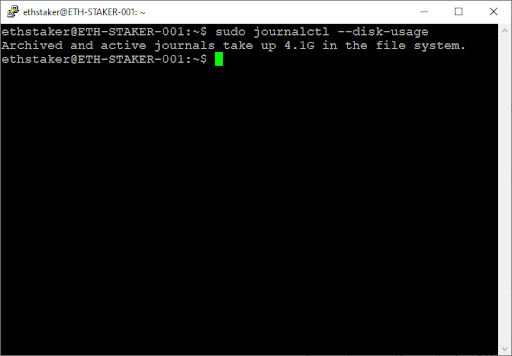

To clear the logs use the following command.

```
$ sudo journalctl --flush --rotate
$ sudo journalctl --vacuum-time=3days
```

The `--flush` flag flushes the logs currently in memory onto the disk.

The `--rotate` flag archives the existing logs so they can’t be written to any more and starts new logs for each service.

The `--vacuum-time` flag deletes log data that is older than 3 days.

**Output should be similar to the screenshot below.**

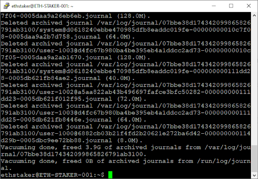

It is recommended to check the logs are in a good state after the vacuum operation.

```
$ sudo journalctl --verify
```

Each log should have a status of `PASS`.

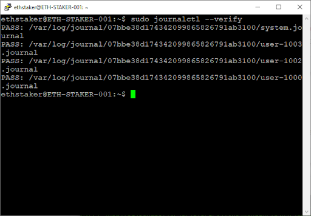

**Automatically Limit Log Size**

If you would prefer to have the system automatically keep log data to a specified max size complete the following additional steps.

Open the systemd journal service configuration file.

```
$ sudo nano /etc/systemd/journald.conf
```

Carefully **edit** the file to set the maximum disk space that can be used by the journal in persistent storage. Remove the `#` from the line `SystemMaxUse` and add a value in megabytes, say `200M`.

**Check the screen shot below for reference. Press CTRL+x then ‘y’ then <enter> to save and exit.**

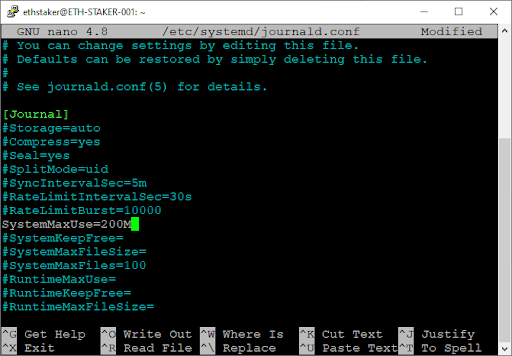

**Restart** the journald after updating the file.

```
$ sudo systemctl restart systemd-journald
```

Journal logs will now be limited to **200MB** in size.

## Appendix F — Expanding the Logical Volume

There are cases where Ubuntu is provisioning only 200GB of a larger SSD causing users to run out of disk space when syncing their Eth1 node. The error message is similar to:

```
Fatal: Failed to register the Ethereum service: write /var/lib/goethereum/geth/chaindata/383234.ldb: no space left on device
```

To address this issue, assuming you have an **SSD** that is larger than **200GB**, expand the space allocation for the [<ins>LVM</ins>](https://wiki.ubuntu.com/Lvm) by following these steps:

```
$ sudo lvdisplay # <-- Check your logical volume size
$ sudo lvm
> lvextend -l +100%FREE /dev/ubuntu-vg/ubuntu-lv
> exit
$ sudo resize2fs /dev/ubuntu-vg/ubuntu-lv
$ df -h # <-- Check results
```

That should resize your disk to the maximum available space.

If you need support on this please check with the [<ins>EthStaker</ins>](https://discord.gg/7z8wzehjrJ) Discord.

<p align="center">
  <b>Full Disclaimer</b>
</p>

This article (the guide) is for **informational purposes only** and does not constitute professional advice.

The author does not warrant or guarantee the accuracy, integrity, quality, completeness, currency, or validity of any information in this article. All information herein is provided “as is” without warranty of any kind and is subject to change at any time without notice. The author disclaims all express, implied, and statutory warranties of any kind, including warranties as to accuracy, timeliness, completeness, or fitness of the information in this article for any particular purpose. The author is not responsible for any direct, indirect, incidental, consequential or any other damages arising out of or in connection with the use of this article or in reliance on the information available on this article. This includes any personal injury, business interruption, loss of use, lost data, lost profits, or any other pecuniary loss, whether in an action of contract, negligence, or other misuse, even if the author has been informed of the possibility.

<p align="right">
  
</p>
