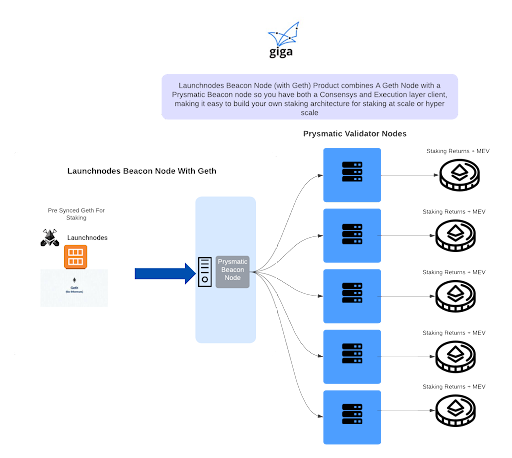
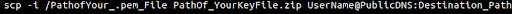

  

## What Is This Document For

People who want to set up an Ethereum Node on a public cloud (AWS) for the purpose of using staking returns to pay for schools internet connectivity as part of Giga.

Before using this document please make sure you have set up your Beacon node with Geth first and that both have synched. If you need any help email: <ins>support@giganodes.com</ins> or <ins>support@launchnodes.com</ins>

## Cloud Vs Local Hosting

At the time of writing this document many governments do not have clear policies in place that allow staking to take place in the country a social impact staker is looking to support. To ensure that you are compliant with local laws, an interim method is to use nodes that are hosted on public cloud. In the pilot project nodes were Launched in AWS. This document allows anyone to follow the pattern established in the pilot.

The goal with the pilot approach was to host the node in the cloud until it became legal and compliant with local laws in Rwanda to host a node locally in the country. This was a decision made by the Impact Staker and donor who in this was Ethereum Foundation.

## Migrating From Cloud to Locally Hosted Nodes

Giga and Launchnodes can provide full support to migrate cloud hosted nodes onto local infrastructure in the country where an impact staker wants to host their nodes.

## Validator nodes That Connect To Beacon Nodes

To stake Ethereum, validator nodes are required to connect to Beacon nodes. The Validator and the beacon node are referred to as consensus layer clients. For the pilot in Rwanda, Prysmatic clients were chosen. The Beacon node Consensus layer client needs to connect to an execution layer client in order to synchronise, for the pilot and more broadly the consensus layer client that is used is Geth. The diagram provides a high level architecture of how the nodes work.

## Custody

Giga does not take custody of the Ethereum being staked. The donor can manage their own custody using the pattern established in this pilot and highlighted in other documentation. This can be done independently, with Launchnodes support or using other custodial solutions.

The impact staker gets their money back after a given period of time that they have committed to support GIga, to ensure this functionality works, impact stakers keep their Ethereum and the nodes they stake on and simply give the returns from their validator nodes.

## AWS Validator Product Instructions

**(This Document Includes Mainnet Configuration of Validator Node)**

**[<ins>Register</ins>](https://www.launchnodes.com/register-for-enhanced-support/) to get free enhanced support that includes**

* Early notification of planned software client updates
* Email/online conferencing support for setting up Beacon and Validator nodes
* Email and online conferencing support for existing Launchnodes products

**This detailed instruction guide will help you to run your validator on AWS. We recommend following this document which is part 1 followed by part 2: [<ins>validator service documentation</ins>](https://docs.google.com/document/d/1L7NVcgevYw4av7WSfl5UG5mjfwyXLNK-jqSClfZA2ZM/edit?usp=sharing).**

**Note: There is also a video guide available that shows these instructions being followed which is embedded as a link in the steps below. Avoid using any static data from the videos.**

Identity Access Management allows you to manage your AWS account and different roles within it, ensuring your nodes are safe. If you don’t have any  IAM configuration setup you will need to configure an IAM User called “Administrator” on your AWS Account then follow the below steps to configure IAM User for your AWS account.

**IAM User Creation**

To see the video of the instructions below please have a look at [<ins>this video</ins>](https://drive.google.com/file/d/1u8Sa0Zvo8JtOXliyy-tLB3xCL5qESfkj/view?usp=sharing).

1. Sign in to the [<ins>IAM console</ins>](https://console.aws.amazon.com/iam/) as the account owner by choosing Root user and entering your AWS account email address. On the next page, enter your password.
2. In the navigation pane, choose Users and then choose Add user.
3. For User name, enter “Administrator”.
4. Select the check box next to AWS Management Console access. Then select Custom password, and then enter your new password in the text box.
5. Choose Next: Permissions.
6. Under Set permissions, choose Add user to group.
7. Choose Create group.
8. In the Create group dialog box, for Group name enter “Administrators”.
9. Choose Filter policies, and then select AWS managed -job function to filter the table contents.
10. In the policy list, select the check box for AdministratorAccess. Then choose Create group.
11. Back in the list of groups, select the check box for your new group. Choose Refresh if necessary to see the group in the list.
12. Choose Next: Tags.
13. Choose Next: Review to see the list of group memberships to be added to the new user. When you are ready to proceed, choose to Create user.

**Creation of Cluster**

To see the video reference of cluster creation please visit video guide [<ins>here</ins>](https://drive.google.com/file/d/1uQQFAuNzg6xaKbyljI25WVcCRrBBgxGq/view?usp=sharing).

To see the video reference related to aws key creation follow our video guide [<ins>here</ins>](https://drive.google.com/file/d/1ClKlq-cSoOUiIxgI02QzHpZbxZTPup-_/view?usp=sharing).

To see the video reference related to security group creation follow our video guide [<ins>here</ins>](https://drive.google.com/file/d/1LRYaKSfSO0zAr28Sym_YdBygF_8bySFq/view?usp=sharing).

1. Go to ECS page (<ins>https://aws.amazon.com/ecs/</ins>) then click on get started with ECS.
2. Select  "Cluster" from the side menu.
3. Select "Create Cluster".
4. Select EC2 Linux + Networking type and click on the next step.
5. Fill out the cluster name field with any name you like. for example validatorcluster
6. Select On-Demand Instance.
7. Choose ec2-instance type(t2.micro is recommended) the instance must have 1 vCPU and 1 GB of memory.
8. Fill the number of instances equal to 1 as we wish to launch only one instance.
9. Select EC2 Ami Id as Amazon Linux 2 AMI
10. Root EBS Volume Size (GiB) make it 30.
11. Then Select key pair from existing keys. If you don't have any existing key pair then you can follow below instructions to create key pair.
    <ol type="a">
        <li>Go to aws console https://aws.amazon.com/console/ and search ec2 in search-bar and click on "EC2"</li>
        <li>Find "Key Pairs" under "Network and Security" from side menu and click on that.</li>
        <li>Click on "Create key pair".</li>
        <li>Enter name of your choice in Name field.(e.g Validator node)</li>
        <li>Select File format option to "pem".</li>
        <li>Click on "Create key pair" and download the pem file.</li>
    </ol>
12. Select vpc from existing vpcs also select subnets from the existing one.
13. Create the security group for your beacon node and to create the security group, we do the following.
    <ol type="a">
        <li>Search EC2 in services and after clicking on EC2 you will be able to see the EC2 dashboard.</li>
        <li>Find Security Groups under Network & Security from the sidebar of the dashboard.</li>
        <li>Click on Security Groups</li>
        <li>Name your security group (e.g Admin) in the Security group name field and also make a short description (e.g Node Administrators) of the group in the "Description" field for your reference.</li>
        <li>Select VPC from existing vpc</li>
        <li>Now, add Inbound rules as follows.</li>
        <li>Click on Add rule in "Inbound rules" select SSH from the "type" drop-down list and add 0.0.0.0/0 to the field after Source.</li>
        <li>Click on Create Security Group and It will create the security group.</li>
    </ol>
14. Click on Create.

**Note**: After a few minutes of configuring your cluster you will need to check if your cluster is correctly configured with an EC2 instance. To check this and confirm its been set up correctly; go to the list of clusters then click on your cluster's name and check the count of "Registered container instances" If it is 0 you must contact AWS support to increase your account's CPU limit because the desired count for "Registered container instances" is 1.

For more information on cluster-creation visit <ins>https://docs.aws.amazon.com/AmazonECS/latest/developerguide/create_cluster.html</ins>

**Creating an IAM Role**

To see the video reference for IAM role creation follow our video guide [<ins>here</ins>](https://drive.google.com/file/d/1MMODbG2Ebx8Te5xTEhljAYCttQ8g8odb/view?usp=sharing).

1. Open the IAM console at <ins>https://console.aws.amazon.com/iam/</ins>.
2. In the navigation pane, choose Roles, Create role.
3. For Select “type of trusted entity section” choose AWS service.
4. Then Choose the service that will use this role, choose Elastic Container Service.
5. For Select your use case, choose Elastic Container Service Task and choose Next: Permissions.
6. For Attach permissions policy, select the policy to use for your tasks (in this example [<ins>AWSMarketplaceMeteringRegisterUsage</ins>](https://console.aws.amazon.com/iam/home?#/policies/arn%3Aaws%3Aiam%3A%3Aaws%3Apolicy%2FAWSMarketplaceMeteringRegisterUsage), and then choose Next: Tags.
7. For Add tags (optional), enter any metadata tags you want to associate with the IAM role, and then choose Next: Review.
8. For Role name, enter a name for your role. For this example, type AWSRegisterUsageRole to name the role, and then choose Create role to finish.

For more information regarding IAM roles please visit this [<ins>document</ins>](https://docs.aws.amazon.com/AmazonECS/latest/developerguide/task-iam-roles.html).

**Deposit Mainnet Ethereum From Launchpad**

**Ethereum Deposit Contract Address: 0x00000000219ab540356cBB839Cbe05303d7705Fa**

To see the video reference for depositing the goeth (testnet ETH) for medalla network (which is eth 2.0 testnet) click [<ins>here</ins>](https://drive.google.com/file/d/17kQehC6xi4lyxy3GoCbzPsC-dO2IPc5o/view?usp=sharing).

**Note: The video reference is for testnet only. Never disclose your mnemonic seeds with anyone.**

1. Visit [<ins>Launchpad</ins>](https://launchpad.ethereum.org/).
2. Read Carefully all the information in the “Overview” section.
3. In the “Select Client” option select Geth client and click on Continue.
4. After that you can see the different ETH 2.0 client names on your screen please select “Prysm” and click on continue.
5. Now you go to the “Generate Keys” section.
6. Enter the number of validators you are looking to register and select your desired operating system.
7. Remember each validator key will cost you **32 ETH**.
8. Now follow the instructions provided to generate a key pair as per your operating system. We recommend “Download Cli App” for the best and easiest user experience. **Remember the password that you used for creating your keys. This will be needed when we import the keys**.
9. After creating the key pairs the next step is to  “Upload Validator”. In this part you will need the deposit data file generated in the previous step.The deposit-data-[timestamp].json which is located in the /eth2.0-deposit-cli/validator_keys directory.
10. After that click on “Continue”
11. Now you need to connect your wallet to the launchpad. **Remember you need to Connect your wallet with Mainnet here**.
12. Choose your wallet and Connect. Please don’t forget to **give appropriate permissions** to the wallet for connectivity.
13. After that go-ahead to the next step which is a summary of what you are doing. You can **check the summary** regarding the transaction.
14. Next we move to “Transactions” and **make a transaction to Ethereum Deposit Contract (Mainnet)**. Please Double check, Triple check the deposit contract address for your ethereum deposit.
15. After this section you will receive a notification regarding the **successful transaction on Ethereum Mainnet**.
16. If your transaction is successful you are in a queue for validator assignment. You will be assigned as a validator soon.

**Check Your Validator Status**

1. Open the deposit-data-[timestamp].json after opening you can see the field “pubkey” copy the value of that field. It will be 96 characters and now [<ins>beaconscan</ins>](https://beaconscan.com/) or [<ins>beaconcha.in</ins>](https://beaconcha.in/) on your browser.
2. You can go on the search bar and paste your keys by attaching 0xYOUR_96DIGIT_KEY_HERE to it and after that, you can see the status of your validator.

**Copy your Validator Key into AWS Instance**

If you are using Linux/Ubuntu/Mac then follow below steps to copy your validator keys into AWS Instance.

To see our video guide related to copying key from **ubuntu supported pc to server** click [<ins>here</ins>](https://drive.google.com/file/d/1Ebg9sxmnZIBCoyTIRt9KrQMI2bgcLeGa/view?usp=sharing).

To see our video guide related to copying key from **Windows supported pc to server** click [<ins>here</ins>](https://drive.google.com/file/d/1oEhSn5I8PleU0kwKR4xEZtrEFXyJ3bON/view?usp=sharing).

1. Create the Zip file of validator_keys folder which was generated during the validator onboarding process.
2. 
3. This above command is commonly used to copy the key from a local pc to a remote server. We recommend using it
4. You can find your public DNS name for instance in EC2 Dashboard after selecting your desired instance. And you have to use the .pem file which was generated during the key pair generation(see step 11 of creation of cluster).
5. Below is a sample command to copy the path from your local computer to the  server instance.
6. `scp -i /home/BeaconNode.pem /home/validator/validator_keys.zip ec2-user@ec2-xx-xxx-xxx-xxx.us-east-2.compute.amazonaws.com:/home/ec2-user` change the line to `ec2-xx-xxx-xxx-xxx.us-east-2.compute.amazonaws.com` using your own EC2 DNS field.
7. Now you can login to the server using below sub commands
    <ol type="a">
        <li>Go to EC2 Dashboard then Click on instances.</li>
        <li>Select your desired instance and click on connect.</li>
        <li>You can see multiple options to connect with the instance, choose the SSH Client.</li>
        <li>Now follow the instructions given on your screen to connect with the instance via SSH.</li>
    </ol>
8. After connecting with the instance, verify the destination location of keys, to check a successful transfer has been made.

**Validator Container Deployment**

**Validator Gateway Task Creation**

Create validator Gateway Task definition from the Launchnodes JSON file to create the task definition by performing the following steps:
1. Go to task definitions from the ECS dashboard.
2. Select create new task definition and then select EC2. Then click on next.
3. Select Configure via JSON and clear the given text and then paste the [<ins>validator_gateway related JSON file</ins>](https://validatortask.s3.us-east-2.amazonaws.com/validator_gateway.json) (provided by Launchnodes) data and then click on save.
4. Select an IAM Role which we have created earlier(IAM Role Creation) in the field “Task Role”.
5. Go to container definitions and select gateway_container and go to Storage and Logging.
6. Select Auto-configure CloudWatch Logs which we recommended to allow you to check your logs.
7. If you want to connect with your own beacon node, rather than a Launchnodes Beacon Node then go to command under environment section and change the flag value to --connect-launchnodes=false and if you are willing to connect with launchnodes’s beacon node then you need to make the flag --connect-launchnodes=true and --beacon_url=IP_ADDRESS_HERE. You need to put the ip address of launchnodes’s beacon node that you will get inside the deployment template of validator inside command section with flag --beacon-rpc-provider=IP_ADDRESS. After that click on Update.
8. Click on create.

To create the task definition you can follow the video guide [<ins>here</ins>](https://drive.google.com/file/d/1YG6TIHDqqw5i9cadFWfBgsjMFeeq_KYX/view?usp=sharing).

**Note: The video guide shows a validator node connecting with a launchnodes beacon node which excludes above step 7. The video guide is for reference only.**

Now, let's run the created task definitions on our ECS cluster.

Before running the service we want to connect to the Beacon node you set up earlier so add the beacon node IP to your EC2 Security group and to add the IP follow the next set of instructions.

**Adding IP to Security Group**
1. Open EC2 Dashboard.
2. Find Network & Security Section located in the side-bar.
3. Click on Security Group.
4. Now Select the security group that we created at the time of cluster creation.
5. Click on, edit inbound rules.
6. Click on, Add rule.
7. Select the Custom TCP if it’s not selected by default from the drop down field.
8. Add the port number 6001 in the port range field.
9. Select Custom from the drop down menu of the source field.
10. Write down the ip of launchnodes’s beacon node that you will get in deployment template inside the commands section with flag --beacon-rpc-provider=IP_ADDRESS_HERE in pattern IP_ADDRESS/32  in a very next field of the source field.
11. Now, Click on Save rules that saves the change we have made recently.

[<ins>Here</ins>](https://drive.google.com/file/d/1mHnXii8NyX7MKy252iaUvRSpkctRmiHq/view?usp=sharing) is a video reference guide to add tcp inbound rules into security group.

**Running The Validator Gateway Services**

1. Click on your created cluster.
2. Select the service tab then click on create.
3. Select launch type ec2.
4. Choose Validator Gateway related task definition(which we have configured via our JSON file earlier) from Task definition Family.
5. Choose a name for the service. For example, gateway_service.
6. Go to the number of task field and type 1.
7. Go to Minimum healthy percent and make it 0.
8. Go to Maximum percent and make it 100.
9. Click next then again next then create.

After Completing these steps please follow the [<ins>validator service documentation</ins>](https://docs.google.com/document/d/1L7NVcgevYw4av7WSfl5UG5mjfwyXLNK-jqSClfZA2ZM/edit?usp=sharing) to run your validator. If you are looking for upgrading the gateway service version then follow the below steps.

[<ins>Here</ins>](https://drive.google.com/file/d/1xN-LU_-njKsPLqpzJCUPRgWCey8qV9TB/view?usp=sharing) is the video guide for running validator gateway services into cluster.

**Updation of Gateway Services**

**Prerequisites:**

1. **You are already running old version of validator gateway services.**

Follow below steps to update your gateway services.

1. Click on marketplace [<ins>validator product link</ins>](https://aws.amazon.com/marketplace/pp/B08LDRGQ8C).
2. Click on “Continue to subscribe”.
3. Now, Click on “continue to configure”.
4. Select “Validator Gateway Container” from Delivery method drop down menu.
5. Click on “Continue to Launch”.
6. Click on “View Container Image Details” from Container Images division.
7. Now, You will be able to see the docker image url on your screen at “**Step 2: Pull all docker images listed below.**” Copy that URL.
8. Now, open <ins>https://aws.amazon.com/console/</ins> and Login into it.
9. Search and click on “Elastic Container Service” from find services bar.
10. Click on “Task Definitions” from side menu.
11. Click on “aws_validator_gateway”
12. Click on the latest validator gateway definition that you created and select “Create new revision”
13. Select “Configure via JSON” button at the bottom of the page.
14. Now, find out “image” and after that you can see that the value of that “image” will be like “117940112483.dkr.ecr.us-east-1.amazonaws.com/xxxxxxxxx/xxxx/xxxx”. You need to change that value with the URL you got on step 7.
15. Click on “save” button.
16. Click on “create” button at the bottom of the page.

Updating the Services of Validator Gateway
1. Click on “Clusters” from the left side menu at your ECS page.
2. Click on the Cluster you have created for the validator node.
3. Select the Service Which was running the old task definition for validator gateway.
4. Click on “Update” button.
5. Select the drop down menu of revision and select the latest revision that we just created you can see the number(Latest) written on the menu. For example If I have created the 4th revision of task then I will be seeing the 4(latest) written on drop down menu.
6. Now, tick the “Force new deployment” box.
7. Click on next step at the bottom of the page.
8. Again Click on “Next Step”
9. Again Click on “Next Step”
10. Click on “Update Service” button.

  

